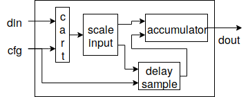

An example: Moving Average Filter
=================================

To illustrate the Gears methodology and PyGears framework we show how a moving average filter can be implemented.
The moving average filter is a simple Low Pass FIR filter commonly used for reducing random noise while retaining a sharp step response.
The filter operates by averaging a number of points from the input signal to produce each point in the output signal. In other words it performs a convolution of the input sequence x[j] with a rectangular pulse of length M and height 1/M as: 

.. math:: y[i] = \frac{1}{M} \sum_{j = 0}^{M - 1}x[i + j]
   :label: filt_formula

The simplified block diagram of the developed core is given on fig. TODO.

The filter has two input interfaces (one used for configuration and the other for data) and has a single output interface.
As with every gear, the interfaces are typed.
The configuration carries two values: average coeficients and the size of the window.
It is represented as a Tuple data type akin to structs or records.
The second input is used for streaming the data and is represented as a Queue data type.
Queue is a data type which describes a transaction and spans multiple cycles.
It has a data field as well as an end of a transaction field.
The compile time parameters are the data width, shift amount and the maximum filter order.
The definition of the moving_avreage gear using PyGears is given in TODO.
Since this is a hierarchical gear the interface type of the output will be determined by the return statement and is not specified here.

.. code-block:: py

    @gear
    def moving_average(
      cfg: Tuple[{'average_coef': Int['w_data'],
                  'average_window': Uint['w_data']}],
      din: Queue[Int['w_data']],
      *,
      w_data=b'w_data',
      shamt=15,
      max_filter_ord=1024):

The filter operates as follows.
Each data sample is first scaled by the average coeficient.
Since each element of the Queue needs to be multiplied, we first create a Queue of Tuples by replicating the average coeficient.
This replication is done using the cart gear where the needed operation is performed automatically based on the input data types.
This is then sent to the scale_input gear which multiplies the elements and shifts the data.
In PyGears the connection between gears can be described using pipe ‘|’ operator.
This corresponds to one module's producer interface being connected to the second modules consumer interface as described in section TODO.
The scale_input gear operates on Tuple data types, not on the Queue data type therefore an fmap operation must be performed (TODO).
Fmap applies the scale_input function to each sample of the data akin to the Python’s map function operating on a list (TODO).
This functor splits the end of transaction information from the data and only sends the data sample and the coeficient value the scale_input gear.
After the operation the the types are merged again and the scaled_input signal is still of the Queue data type.
Usage of this functor allows the scale_input to be an independent gear with single responsibility which can be easily reused.
Functors are powerful patterns for gear composition that significantly improve possibilities for gear reuse.
There is one functor for each complex data type.
Functors allow for gears that operate on simpler data types to be used in context where a more complex data type is needed.
PyGears can automatically generate such a structure based on the input type and gears that are to used inside a functor.

.. code-block:: py

   scaled_input = cart(cfg['average_coef'],
                       din) \
        | fmap(f=scale_input(shamt=shamt,
                             w_data=w_data),
               lvl=1,
               fcat=czip)

After the input has been scaled, the accumulation takes place in the following maner.
Each new sample is added to the sum and outputed.
When the current window is finished, the first sample, which is no longer in the window, needs to be removed from the accumulated sum and the calculation resumes in the same manner.
The accumulation takes place in the accumulator gear, while the delay_sample gear is used for appropriate generation of the substracted value.
This is implemented in the body of the moving_average gear, as shown in TODO.
Since the scaled_input needs to be used for in both the accumulator and the delay_sample gears broadcast logic is needed to ensure correct synchronization between the gears and that each sample is sent to both gears.
In PyGears this is done automatically.

.. code-block:: py

    delayed_din = (scaled_input,
                   cfg['average_window']) \
        | delay_sample(w_data=w_data,
                       max_filter_ord=max_filter_ord)

    return (scaled_input, delayed_din) \
        | accumulator(w_data=w_data)

In the accumulator gear, shown in TODO, containts a feedback loop that cannot be described as a plain gear composition since it forms a cycle.
This cycle needs to be cut at one spot, described as the gear composition and then stitched together as shown in TODO.
The second_operand interface is first defined and passed to the sample_calc gear and is later assigned from the decoupled accumulator output.

.. code-block:: py

   @gear
   def accumulator(din, delayed_din, *, w_data):
       second_operand = Intf(dtype=Int[w_data])
   
       average = din \
           | fmap(f=sample_calc(second_operand,
                                delayed_din,
                                w_data=w_data),
                  lvl=1,
                  fcat=czip)
   
       average_reg = average \
           | project \
           | decoupler
   
       second_operand |= priority_mux(
                average_reg,
                const(val=0, tout=Int[w_data])) \
           | union_collapse
   
       return average

The sample_calc gear is a calculation gear where the addition and substraction takes place.
All arithmetic operators are supported by PyGears and automatically generated.

.. code-block:: py

   @gear
   def sample_calc(din, add_op, sub_op):
      return (din + add_op - sub_op)

Similarly to the scale_input gear, an fmap is used.
The result of the calculation is broadcasted to the output and to the second_operand calculation.
The value is first sent to the project and decoupler gears, which discard the Queue information and register the data.
The priority mux and const gears are used to either pass a zero value (for the first sample) or the registered value.

..
   long version
..
   As for the delayed sample that needs to be substracted from the accumulated sum, the information about the size of the window, which is the number of samples in the window, is needed and sent to the configuration input.
   This configuration is used to decide whether the actual substraction needs to take place or neutral zero values are sent instead.
   To ensure proper synchronization, zero values are substracted from every sample in the window and the scaled_input value is stored in a fifo and sent to the accumulator gear when the window completes.

   .. code-block:: py

      @gear
      def delay_sample(din, cfg, *, w_data, max_filter_ord):
          din_window = din \
              | project \
              | fifo(depth=2**bitw(max_filter_ord))

          initial_load = ccat(cfg,
              const(val=0, tout=Int[w_data])) \
              | replicate \
              | project

          return (initial_load, din_window) \
              | priority_mux \
              | union_collapse

..
   short version
As for the delayed sample gear a FIFO gear is used to store the passed sample values.
The configuration will determine weather the value from the FIFO or a zero value will be sent to the accumulator gear.

Based on the python description of the moving_average gear, PyGears generates a SystemVerilog description.
Implementation of developed IP core was done using Xilinx's Vivado tool.
Target FPGA device for the implementation was Zynq-7020.
The most interesting implementation results, regarding used hardware resources for the sample width of 16 bits and the maximum filter order of 1024, are presented in Table TODO.

+------------+------------+---------+-----+------+
| Total LUTs | Logic LUTs | LUTRAMs | FFs | DSPs |
+------------+------------+---------+-----+------+
| 970        | 266        | 704     | 135 | 1    |
+------------+------------+---------+-----+------+
