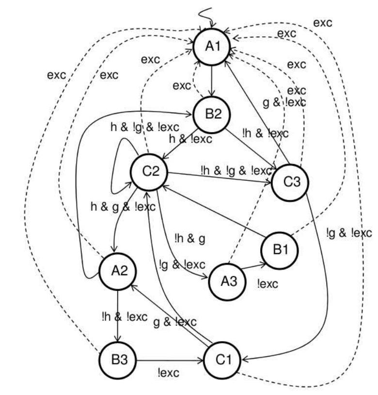

RISC-V Blog Series Introduction
===============================  

.. post:: October 06, 2018
   :author: Bogdan
   :category: RISC-V

.. verbosity_slider:: 2

Welcome to the blog series in which I'll be implementing the `RISC-V ISA <https://riscv.org/risc-v-isa/>`_ (Instruction Set Architecture) in hardware using functional approach with `PyGears <https://www.pygears.org/index.html>`_. My aim is to show how PyGears offers a way to build hardware in an incremental, evolutionary fashion, where the architecture, implementation and the verification environment evolve together, as opposed to the standard approach where these steps mostly happen in sequence. Developing hardware in such an `agile <https://en.wikipedia.org/wiki/Agile_software_development>`_ way offers many benefits to the hardware design process, with some of them being that:

- I don't need to take into the account all the requirements from the start in order to design the architecture before I start the implementation. :v:`2` This means that I will sooner start the implementation and have feedback about my architectural choices and thus avoid catching architectural errors late, which are then most expensive to fix.
- I can get an `MVP <https://en.wikipedia.org/wiki/Minimum_viable_product>`_ (Minimum Viable Product) early, which means that I can start `system testing <http://softwaretestingfundamentals.com/system-testing/>`_ early and try to catch errors in the design's `functional requirements <https://en.wikipedia.org/wiki/Functional_requirement>`_ as early as possible.  
- I can maintain my MVP, so that the customer can try to use the hardware at different stages throughout the development. :v:`2` This offers him a chance to shorten the time-to-market and may provide me with the valuable feedback. This can again lead to the change to the requirements which I would like to have as early as possible.  

"Hardware" and "requirements change" are two things that were not meant to go together, but the electronics industry is developing at an ever accelerating pace so this needs to change. :v:`2` This is also recognized by the very authors of the RISC-V ISA, and summed up in their paper `AN AGILE APPROACH TO BUILDING RISC-V MICROPROCESSORS <https://people.eecs.berkeley.edu/~bora/Journals/2016/IEEEMicro16.pdf>`_.

Why PyGears?
------------

.. verbosity:: 2

Traditional HDLs and design methodologies built around them are ill-suited for building larger hardware systems, because they offer very few means of abstraction, besides grouping the implementation into modules. Modules are furthermore quite often formed in the wrong way, by bundling various functionalities together because they operate on the same data, even though they serve different purposes. Think big clunky control path state machines with many outputs which are usually the major source of bugs and a major obstacle for adding new features.

   Image from `<http://ece-research.unm.edu/jimp/codesign/slides/microprogramming.pdf> <http://ece-research.unm.edu/jimp/codesign/slides/microprogramming.pdf>`_

Each of these outputs is probably computed by a functionality that deserves its own module, its own little abstraction. Why are they than being sucked into state machine module monsters? Usually because we either believe that it leads to a more optimized design, or we are afraid of synchronization issues. But wire is a wire even if it leaves the module boundaries, and decent hardware synthesis tools offer inter-module optimization, so we lose next to nothing by factoring out the functionality. As for the synchronization, putting everything in a single module just offers a false sense of security and sweeps the problem under the rug until later when functionality piles up inside the module and pipelining becomes a nightmare, not to mention dealing with synchronization issues between such complex modules.

.. verbosity:: 1

Since the biggest issue with maintaining a large hardware design is synchronization (as with any other massively parallel system: think multithreading in software), PyGears tries to face it upfront by forcing each module to implement a `flow-controlled interface <https://www.pygears.org/gears.html#one-interface>`_, which turns modules into "gears" in PyGears terminology (checkout this `quick introduction to gears <https://www.pygears.org/gears.html>`_). :v:`2` As much as it may seem as an overkill in the beginning, it usually pays-off later, and is easily optimized-away by the hardware synthesis tools if not really needed. :v:`1` Gears are not built around the state, but are formed to group and abstract some functionality, while the state is embedded in the data sent between the gears. This further alleviates the synchronization problem and pipelined architectures arise naturally, as I intend to show while implementing RISC-V ISA.

.. tikz:: DTI - Data Transfer Interface
   :libs: arrows.meta, shapes
   :include: ../../manual/dti.tex

Gears are also assigned `data types <https://www.pygears.org/gears.html#powerful-type-system>`_ for their interfaces, which dramatically eases their composition. If gears are easily **composable**, then they can be used in wider variety of situations, hence they are **reusable**. It makes sense then to create well-thought-out and well-tested **libraries of gears** (like `cookbook <https://github.com/bogdanvuk/pygears/tree/master/pygears/cookbook>`_ and `common <https://github.com/bogdanvuk/pygears/tree/master/pygears/common>`_ libraries shipped with PyGears), which pays off in the long run by reducing the design time and reducing the number of bugs. :v:`2` Absence of such libraries in other HDLs, speaks for itself.

:v:`2` Paradigm shift the PyGears framework offers over traditional HDLs is analog to the difference in paradigm between `OOP <https://en.wikipedia.org/wiki/Object-oriented_programming>`_ (Object Oriented Programming) and `Functional programming <https://en.wikipedia.org/wiki/Functional_programming>`_. In OOP, you program in terms of objects, which are in turn formed to enclose certain state and provide operations that depend on that state and can change it. This is very similar to how HDL modules are formed, as discussed earlier in this chapter. On the other hand, in functional programming, you program in terms of functions and types of the data passed between them, which is exactly how you describe hardware with PyGears. It is widely considered that parallel software designs are easier described using functional programming paradigm, so my aim is to show in this blog series that the same holds for the hardware design.   

Furthermore, PyGears is written in Python and offers a way to run RTL simulation together with asynchronous Python functions, in which arbitrary functionality for stimulus generation, value checking, logging and gathering statistics. :v:`2` Some advantages over SystemVerilog are that Python is open-sourced, much more popular, has huge library of packages and has cleaner syntax. 

:v:`2` Why not some of the existing modern HDLs?
------------------------------------------------

.. verbosity:: 2

I am aware of several other attempts at higher level HDLs, like: `Chisel <https://chisel.eecs.berkeley.edu/>`_, `Bluespec <http://bluespec.com/>`_, `Clash <http://www.clash-lang.org/>`_ and `MyHDL <http://www.myhdl.org/>`_. I never dug deeper into these languages, so I'm not able to give an in depth analysis of each of them here. It's not that I don't plan to learn them better sometimes, as I'm sure they have many brilliant ideas incorporated, it's just that they didn't seem to really offer solutions to the problems discussed in the previous chapter. Even Clash, which takes the functional approach, in my opinion missed the opportunity to really raise the level of abstraction, by still dealing with the individual signals (as opposed to the flow-controlled interfaces in PyGears) and thus significantly lowering the composability of the modules. Other languages mentioned here take state-centric path of the traditional HDLs and so I truly feel that PyGears has to offer something better.  

Writing tests as a design tool
-------------------------------

Usually the hardware implementation effort is split between the design and verification teams, where the design team leaves all the testing to the verification. I think that this is a bad dichotomy and tend to agree with the `TDD <https://en.wikipedia.org/wiki/Test-driven_development>`_ (Test-Driven Development) philosophy which points-out the importance of the developers tests. These are the tests written by the designers continuously during the development, which test each of the functional requirements of the design.

.. verbosity:: 2

According to the TDD, the implementation of each functional requirement should be performed in three steps: red, green and refactor:

1. Red: Add tests to verify the functional requirement. Run the tests to check that they fail, which they ought to do since the functionality hasn't been implemented yet. 
2. Green: Work on the functionality implementation until all the tests pass (new ones as well as the ones testing previously implemented requirements).
3. Refactor: Clean-up the code without breaking the tests

.. verbosity:: 1

For the RISC-V implementation, I plan on treating each instruction in the ISA as a separate functional requirement, so I should have a following flow:

1. Write a test that feeds the instruction to the processor and checks the memory and register state after the execution against the `Spike <https://github.com/riscv/riscv-isa-sim/>`_ RISC-V ISA simulator (which will serve as a reference model),
2. Implement the instruction in hardware and verify that the test passes together with all the tests for the previously implemented instructions,
3. Refactor the processor implementation.

Besides functional correctness, one additional important processor design quality parameter is its throughput. So, in addition to the functional tests for each of the instructions, I plan to use Vivado to test attainable frequency for my design.

.. verbosity:: 2

Even though I'm aware of the already proposed architectures for the RISC-V processor (like the one in the `Computer Architecture: A Quantitative Approach <https://www.amazon.com/Computer-Architecture-Quantitative-Approach-Kaufmann/dp/0128119055>`_), I will try to blank out the memory of them, and let the new one, guided by the PyGears principles, arise on its own.  

.. verbosity:: 1

.. _riscv-introduction-setup:

Setup
-----

For this series I'll be working on Ubuntu 18.04. For the detailed description of the tools I'm going to use and how to set them up, please refer to `PyGears tools setup <https://www.pygears.org/setup.html#setup-pygears-tools>`_. You can of course choose an alternative to all these tools (except for the PyGears framework itself I hope). Furthermore, PyGears has been tested to work on Windows and openSUSE as well, so feel free to use the OS of your choice. In short you will need: 

1. PyGears,
2. An RTL simulator: I'll be using mostly Verilator since it is open-source, but I will try to provide an option in the code to run Questa or Cadence simulators as well, 
3. A waveform viewer: I'll be using GtkWave since again it is open-source, but if you plan on using a proprietary simulator, they will come with a waveform viewer,
4. A constrained random solver: I'll try to use `SCV <http://www.accellera.org/activities/working-groups/systemc-verification>`_. Again proprietary simulators have support for this too,
5. Various RISC-V tools, for which I will make further posts on how to setup and use.

I'll be using Spacemacs for editing files and running Python scripts, but I'll try to test the procedures I layout in blog posts on PyCharm as well.

Logistics
---------

All the files related to the RISC-V implementation will be placed in ``examples/riscv`` folder of the PyGears git repository. At the beginning of each blog post, I will state which exact git commit contains code relevant to that post, so that you can get back in history and inspect files at that development stage. 

Notice also a slider at the beginning of the post. It allows you to choose verbosity of the text. I plan to use it for all future posts in a fashion similar to this:

- Verbosity level 1: Only as much information as needed to reproduce the results the post is discussing,
- Verbosity level 2: Additional details and explanations about each of the steps involved in the discussed procedure,
- Verbosity level 3: Various digressions, brain dumps, detailed results of the procedure steps (log files, command outputs), etc.
