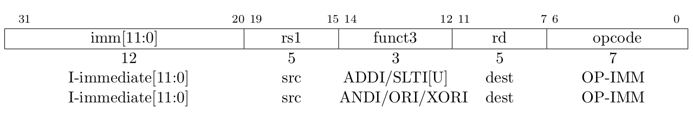
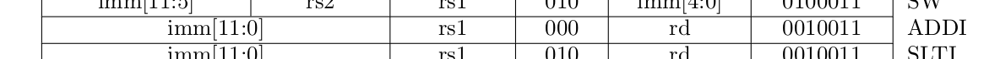
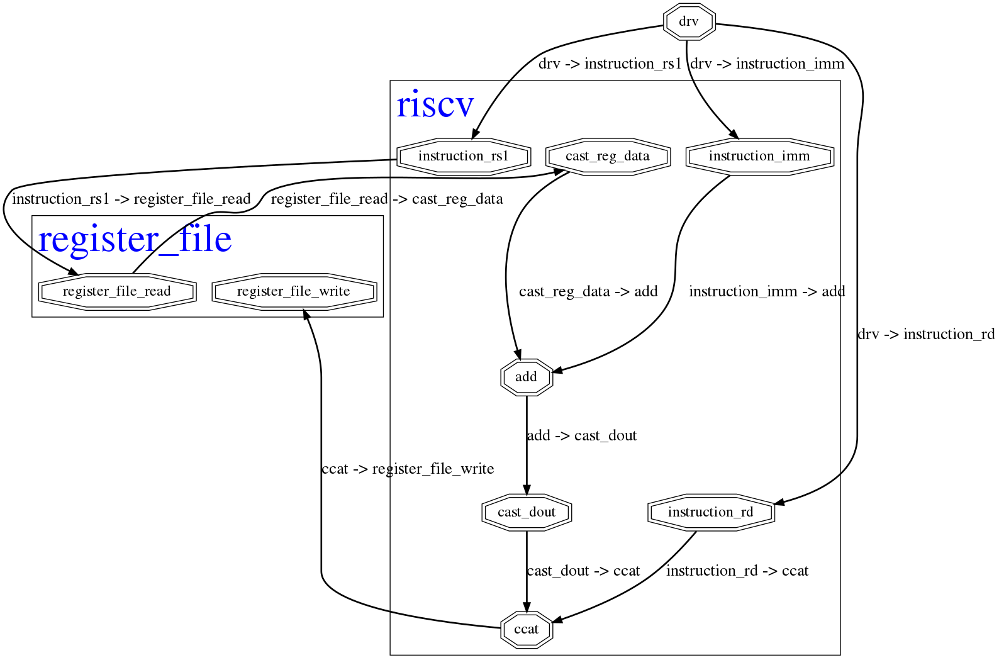

.. role:: html(raw)
   :format: html

.. role:: py(code)
   :language: py
   :class: highlight

.. urlinclude::
   :branch: 4b3c39d
   :github: bogdanvuk/pygears_riscv

My First Instruction
====================

.. post::
   :author: Bogyman
   :category: RISC-V

.. _RISC-V ISA Specification: https://content.riscv.org/wp-content/uploads/2017/05/riscv-spec-v2.2.pdf

.. verbosity_slider:: 3

:v:`2` First instruction is probably going to be unlike any other in the amount of work that I'll need to put into implementing it, so it deserves a post on its own. :v:`1` Let's start from the RV32I description in the (currently) latest version of the `RISC-V ISA Specification`_, which is given in the `Chapter 2: RV32I Base Integer Instruction Set <https://content.riscv.org/wp-content/uploads/2017/05/riscv-spec-v2.2.pdf#page=21>`_. The specification first goes on to describe `Integer Computational Instructions (Chapter 2.4) <https://content.riscv.org/wp-content/uploads/2017/05/riscv-spec-v2.2.pdf#page=25>`_, of which the ``addi`` instruction is explained first, so let's start with that one.

.. verbosity:: 2

All RV32I instructions are encoded with 32 bits using several formats (although there is also a `Compressed Instruction Formats (Chapter 12.2) <https://content.riscv.org/wp-content/uploads/2017/05/riscv-spec-v2.2.pdf#page=81>`_ but I'll leave that for later). All the information needed for the instruction execution has to be encoded in 32 bits and these formats specify where exactly is each peace of information located within these 32 bits. Usually the instruction needs to specify which operation to perform (``opcode`` and ``funct`` fields), which registers are involved (``rs`` - register source or ``rd`` - register destination), and usually provides some immediate values as arguments (``imm`` fields). :v:`3` One of the key advantages of the RISC-V ISA is that pieces of information of the same type (like ``rd`` field) are usually located at the same position within the 32 bit encoding for different formats, which proved to simplify the hardware implementation.

For RV32I, a set of 32 registers is needed, named ``x0`` - ``x31``, where ``x0`` is different from the others in that it has a fixed value of 0, i.e it's value cannot be changed. The ISA specification defines the ``XLEN`` parameter to represent the width of the registers in number of bits: either 32 or 64. :v:`3` I'll try to keep ``XLEN`` a design parameter of the processor implementation, but I'll first focus on a version with ``XLEN=32``, i.e with the processor version with 32 bit wide registers.

.. verbosity:: 1

Instruction format
------------------

The ``addi`` instruction has an "Integer Register-Immediate" format, aka the "I-type" format shown on the image below. :v:`2` The instruction is executed by adding the value of the 12 bit immediate field ``imm`` to the value read from the register specified by the ``rs1`` field. The result is then truncated to ``XLEN`` bits and stored into the register specified by the ``rd`` field. 

   "Integer Register-Immediate" instruction format, aka the "I-type" format, from the `RISC-V ISA Specification`_

Since the instruction encodings have fields that serve different purposes from one another, I'll represent the instruction with the :any:`typing/tuple` PyGears type. :v:`2` The :any:`typing/tuple` type represents a generic heterogeneous container type akin to records and structs in other HDLs, and I can specify the names and types of the fields by providing a Python dict in square brackets which maps field names to the field types. :v:`1` For the "I-type" instructions, I ended-up with a following definition in PyGears, given in :giturl:`pygears_riscv/riscv/riscv.py`:

.. data:: TInstructionI

  .. code-block:: python

    TInstructionI = Tuple[{
        'opcode': Uint[7],
        'rd'    : Uint[5],
        'funct3': Uint[3],
        'rs1'   : Uint[5],
        'imm'   : Int[12]
    }]

.. verbosity:: 2

The ``opcode`` and ``funct3`` fields determine the function to be executed, and ``rd``, ``rs1`` and ``imm`` fields carry the function arguments. The ``opcode`` and ``funct3`` fields store the ID of the function, so I can represent them with an unsigned number, i.e the :any:`typing/uint` PyGears type. :v:`3` An enumerated type might constrain this fields better, since not all function IDs might be available in a specific processor implementation (after this blog post I will have implemented only one function - ``addi``). However, PyGears doesn't yet have enumerated types, so I'll use the :any:`typing/uint` type as the second best.

Values of the ``rs1`` and ``rd`` fields contain the IDs of the registers involved, hence they are 5 bit wide so that they can encode all 32 register IDs, hence they are represented by the :any:`Uint[5] <typing/uint>` type. ISA specifies that ``addi`` as a signed operation, and that the values in the ``imm`` field are encoded as signed integers, so I'll use :any:`Int[12] <typing/int>` type here.

Now any gear that operates on the ``imm`` field can, if needed, automatically adjust its operation to handle the signed numbers correctly, and I don't have to worry about it for every gear explicitly. :v:`3` This is a major advantage of the typing system, since I can express my intents using the type (like with :any:`Int <typing/uint>` here) in a single place in the code, and this intent will propagate automatically throughout the design. Traditional HDLs offer only rudimentary typing support, so you need to follow you signals around and explicitly. However, just specifying the type is only a half of the story. The other half lies in providing the `polymorphic <https://en.wikipedia.org/wiki/Polymorphism_(computer_science)>`__ behavior for the modules, so that they automatically accommodate for different data types.

.. verbosity:: 1

:v:`2` OK, so now we have the :py:data:`TInstructionI` type, that describes the general format for the "I-type" instructions, and my ``addi`` instruction will be an instance of this type. :v:`1` As I said, ``opcode`` and ``funct3`` will have unique, specific value for the ``addi`` instruction which is specified by ISA. I had to consult `Chapter 19: RV32/64G Instruction Set Listings <https://content.riscv.org/wp-content/uploads/2017/05/riscv-spec-v2.2.pdf#page=115>`_ in order to get the correct values for the function ID fields: :py:`opcode=0x13` and ``funct3=0x0``. 

    ``addi`` instruction format, from `RISC-V ISA Specification`_

Other instruction fields: ``rd``, ``rs1`` and ``imm``, can take arbitrary values, so I can't fix those in advance. This gives me the following template for the ``addi`` instruction: 

.. py:data:: OPCODE_IMM

   :py:`OPCODE_IMM = 0x13`

.. py:data:: FUNCT3_ADDI

   :py:`FUNCT3_ADDI = 0x0`

.. py:data:: ADDI

   .. code-block:: python

      ADDI = TInstructionI({
          'opcode': OPCODE_IMM,
          'rd'    : 0,
          'funct3': FUNCT3_ADDI,
          'rs1'   : 0,
          'imm'   : 0
      })

:v:`2` Since PyGears doesn't have templates for type instances, all I can do is assign some default values to the fields whose values can change. :v:`3` Maybe its worth considering whether true generic templates (with generic parameters) for the type instances would add anything of value (or researching if there are languages that support these). In that case, instead of zeros above, the fields would be assigned some template placeholder names, that would need to be assigned values later. Prolog does something like that?

Processor implementation
------------------------

:v:`2` Since the idea of this blog series is to show how one can evolve a complex hardware design using PyGears without wasted effort, by implementing one feature at a time, I will turn a blind eye to the fact that RISC-V processor needs to support multiple instructions at this moment. I will exclude the PC manipulation functionality, which gets important once jump instructions get into play, and the interface to the data memory, which gets important once load and store instructions git into play. For now I will move the :giturl:`register file <pygears_riscv/verif/register_file.py>` outside the processor into a separate module and implement it in pure Python to ease reading and writing for the verification purposes. :v:`3` Later, I'll provide an RTL implementation of the register file, but it is a simple module and it should be a straightforward design process, so I don't feel like cheating for postponing it. :v:`2` Important concepts for describing gears are sketched-out in this :ref:`Quick Introduction <pygears:introduction>` documentation page. :v:`1` Without further ado, this single-instruction capable RISC-V processor written in PyGears looks like this:

.. literalinclude:: pygears_riscv/riscv/riscv.py
   :github: bogdanvuk/pygears_riscv
   :pyobject: riscv

.. verbosity:: 2

Let's dig deeper into those 6 lines of code. The :py:`@gear` statement is called a decorator in Python terminology. If it is placed in front of the function definition it can wrap it with some additional code. The :py:`@gear` decorator is where most of the magic happens in PyGears. It makes a function composable via  '|' (pipe) operator, it performs type checking and matching, it instantiates a new hardware module each time the function is called, it takes care about module hierarchy, etc.

Next, the `function prototype <https://en.wikipedia.org/wiki/Function_prototype>`__  declares the types of input interfaces the ``riscv`` gear accepts, namely: :py:`instruction: TInstructionI` and :py:`reg_data: Uint['xlen']`. So on the first interface ``riscv`` expects to see a flow of instructions of the "I-type" format, and on the second, the operation argument read from the register determined by the ``rs1`` field (``riscv`` gear will issue these read requests as we'll see in the moment). For the details on how PyGears implements interfaces in HDL, checkout the PyGears documentation section :ref:`One Interface <pygears:gears-interface>`. The ``riscv`` gear is implemented via the gear composition, so I needn't specify the output interface types since they will be determined by the interfaces returned from the ``riscv()`` function.

In order to instantiate the ``riscv`` gear, all the input interfaces need to be specified as arguments to the ``riscv`` gear function. Inside the ``gear`` function, ``instruction`` and ``reg_data`` become local variables that bring the interface objects from the outside and distribute them to the internal gears. :v:`1` Image below shows the resulting processor structure and connection with its environment. :v:`2` The graph was auto-generated with the :giturl:`riscv_graph.py script <pygears_riscv/script/riscv_graph.py>`. 
.. verbosity:: 1

    Graph of the single-instruction RISC-V processor implementation in PyGears. The gears are drown as octagons and hierarchical modules are drawn as boxes.

.. verbosity:: 2

First line of the function: :py:`reg_file_rd_req = instruction['rs1']`, forms a read request for the register file and results in the ``instruction_rs1`` gear shown in the graph above. The request consists only of the register ID from which to read the data, which is given in the ``rs1`` instruction field. Simply by slicing the ``instruction`` interface with the field name, I can tell PyGears to extract the desired part of the incoming data. For more information about slicing the :any:`typing/tuple` type, checkout :meth:`Tuple.__getitem__() <pygears:pygears.typing.tuple.TupleType.__getitem__>`. This is a zero-overhead abstraction and results in nothing but wiring in generated SystemVerilog. After Python executes this statement, the variable ``reg_file_rd_req`` contains the output interface of the ``instruction_rs1`` gear (this is a :any:`sieve <pygears.common.sieve>` gear, automatically generated whenever interfaces are sliced), which is later lead out of the ``riscv`` gear by returning the variable value: :py:`return reg_file_rd_req, reg_file_wr_req`.  

.. verbosity:: 3

In order to the get nice names for the automatically generated :any:`sieve <pygears.common.sieve>` gears, I need to set ``gear/naming/pretty_sieve`` configuration variable to ``True``. These configuration variables can be accessed and modified via the PyGears :ref:`registry <pygears:registry:registry>`. PyGears also supports the configuration files that are automatically loaded during the framework initialization. During the initialization, PyGears searches for the file with the name ``.pygears.py`` in the following locations: ``~/.pygears/``, current working directory, and all the parent directories of the current working directory. Current working directory is the location of the user python script being run where PyGears has been imported. I've placed the ``pretty_sieve`` configuration inside :giturl:`pygears_riscv/.pygears.py`, so that it is loaded for all scripts within ``pygears_riscv`` project. 

.. verbosity:: 2

Next, data read from the register file is cast to an :any:`Int <typing/int>` to be interpreted as a signed number: :py:`reg_data_signed = reg_data | Int[int(reg_data.dtype)]`. The expression: :py:`int(reg_data.dtype)` is used to retrieve the width of the ``reg_data`` interface type, and the :any:`Int <typing/int>` type is made to be of that same width. The ``reg_data_signed`` variable carries the output signed interface of this operation This results in the ``cast_reg_data`` gear shown in the graph. 

Then, the signed addition is performed between the ``reg_data_signed`` and the ``imm`` instruction field, resulting in the ``add`` gear in the graph. Finally, the addition result is cast back to the type of the ``reg_data`` interface: ``reg_data.dtype``, which truncates the result by 1 bit and changes its type back to the unsigned integer. The interface carrying the result of these operations is stored in the variable ``add_res``. 

Next, the write request :py:`reg_file_wr_req = ccat(instruction['rd'], add_res)` is formed, with which the register file is instructed to store the result of the addition (variable ``add_res``) into the register specified by the ``rd`` instruction field. These two pieces of information are combined in a :any:`typing/tuple` by using :any:`ccat <pygears.common.ccat>` (short for concatenation) gear from the :any:`pygears.common <gears/common>` library. 

.. verbosity:: 1

The read and write requests are output from the ``riscv`` gear by outputting them from the function, and will be connected to the inputs of the register file module in a higher hierarchy level.

Verification environment
------------------------

For testing the ISA implementation, I've envisioned the following test:

#. Initialize the register file
#. Send a stream of instructions to the processor
#. Check the final register values to the reference design

I've written an environment that supports these kinds of tests in :giturl:`pygears_riscv/verif/env.py`. This is a regular Python function (not a gear) that instantiates the ``riscv`` and ``register_file`` gears and wires them properly in the following manner.

.. bdp:: images/addi-env-block-diagram.py
    :align: center
    :width: 80%

.. verbosity:: 2

Relevant part of the :func:`riscv_instr_seq_env` function is given below:

.. literalinclude:: pygears_riscv/verif/env.py
   :github: bogdanvuk/pygears_riscv
   :pyobject: riscv_instr_seq_env
   :lines: 1, 16-

Here you can see the signature of the function and description of its parameters:

.. py:function:: riscv_instr_seq_env(instr_seq, xlen=32, reg_file_mem={})

    Drives riscv with an instruction sequence.

    :parameter instr_seq: Sequence of instructions to send to riscv, encoded as :py:data:`TInstructionI`
    :parameter xlen: Width of the riscv registers in bits
    :parameter reg_file_mem: Initial register file dictionary that maps register IDs to their initial values
    :return: reg_file_mem

The :func:`drv <pygears.sim.modules.drv>` gear can be used to drive a sequence of values to an input interface of a gear. In this case it will drive the sequence of instructions, passed via ``instr_seq`` argument: :py:`instruction = drv(t=TInstructionI, seq=instr_seq)`. As you can see, the ``t`` and ``seq`` arguments to the :func:`drv <pygears.sim.modules.drv>` gear need to be specified using keywords. The reason is that PyGears needs to distinguish between gear input interfaces and gear parameters, so only input interfaces are allowed to be passed as positional arguments (without argument names). 

Next, I hook up the ``riscv`` and ``register_file`` gears in the manner shown on the block diagram. You can see from the diagram that these two gears form a kind of a loop, so their connection cannot be expressed in a forward only manner. In these cases, we need to first break the loop somewhere, then connect the gears in a forward manner, and finally reconnect the loop at the point where it was broken. I decided to brake the loop at the ``reg_rd_data`` interface (as shown on the block diagram), so I explicitly instantiated the interface object with the desired type for the ``reg_rd_data`` interface: :py:`reg_rd_data = Intf(Uint[xlen])`. This way we can feed it to the ``riscv`` gear, together with the ``instruction`` interface, and the ``riscv`` gear will have all the information needed to resolve itself and produce the output interfaces: :py:`reg_file_rd_req, reg_file_wr_req = riscv(instruction, reg_rd_data)`

Finally, I connect ``riscv`` read and write request interfaces to the ``register_file`` gear, which gets instantiated and returns its output interface. Instead of it being fed to another gear or assigned to a variable, I use the pipe assign operator ``|=`` to instruct PyGears that this output interface is in fact the ``reg_rd_data`` interface I defined before. This closes the loop and everything is connected as shown on the block diagram.  

.. verbosity:: 1

Spike interface
~~~~~~~~~~~~~~~

:v:`2` In my previous blog post :doc:`pygears:setup`, I showed how to implement a rudimentary interface for the `Spike <https://github.com/riscv/riscv-isa-sim/>`__ simulator that I plan to use as a reference ISA design. Now, I'll show how to put it to action for verifying the ``addi`` instruction implementation. :v:`1` I relocated the Spike interface class to :giturl:`pygears_riscv/verif/spike.py` and had to make one major change to accomodate for the RISC-V `ABI (Application Binary Interface) <https://en.wikipedia.org/wiki/Application_binary_interface>`__.

:v:`3` First, I was surprised to find that issuing the read register command didn't return any value in Spike simulator if the registers were named with prefix "x" (``x*``). I started digging and found out that even though all registers ``x1`` - ``x31`` were created equal in the ISA specification, in order to cooperate better with C compilers additional rules were created, namely the ABI. :v:`2` `Chapter 20: RISC-V Assembly Programmer’s Handbook <https://content.riscv.org/wp-content/uploads/2017/05/riscv-spec-v2.2.pdf#page=121>`_ provides the table that maps the native ``x*`` register names to their ABI equivalents, and specifies special purpose for each of the registers. It turns out that the Spike simulator understands only the ABI register names. :v:`3` Some additional information on the ABI, together with the examples of the assembly instruction syntax, is also given on `riscv/riscv-elf-psabi-doc github <https://github.com/riscv/riscv-elf-psabi-doc/blob/master/riscv-elf.md>`__. 

I created a wrapper class around my Spike interface inside :giturl:`pygears_riscv/verif/spike_instr_test.py`, which automates all the tasks I did manually in the :doc:`previous blog post <pygears:setup>`, namely: writting the assembly file, running the gcc, and calling Spike interface with the correct parameters. I also added the possibility to easily initialize the register values which will come in handy for thourough verification.

.. verbosity:: 2

The entry point to this Spike interface is the function :py:func:`run_all`, whose signature is explained below.

.. py:function:: run_all(instructions, outdir='.', reg_file_init=None)

    Runs a set of instructions on Spike simulator and returns the resulting state of the register file

    :parameter instructions: Sequence of instructions to execute in Spike, encoded as :py:data:`TInstructionI`
    :parameter outdir: Directory in which to store the intermediate files
    :parameter reg_file_init: Initial register file dictionary that maps register IDs to their initial values
    :return: The initial and the resulting state of the register file

Based on the arguments passed for ``instructions`` and ``reg_file_init`` parameters, an assembly file will be generated, which will then be compiled using gcc and finally simulated using Spike. After that, the resulting state of the register file will be read out, so that it can be compared with the results of the processor design simulation. :v:`3` Assembly file is generated using a following `Jinja2 <http://jinja.pocoo.org/>`__ template:  

.. verbosity:: 3

.. literalinclude:: pygears_riscv/verif/spike_instr_test.py
   :github: bogdanvuk/pygears_riscv
   :lines: 27-61
   :language: jinja

Besides the boilerplate code explained in :doc:`pygears:setup`, there are three ``for`` loops in the template that generate the code that:  

#. Defines a constant for each register initial value supplied via the ``reg_file_init`` argument.
#. Loads the constants to the registers. It requires two commands to load a 32 bit value to the register, since RISC-V instructions have fixed size of 32 bits, so they cannot contain a 32 bit immediate value besides the ``opcode`` field.
#. Executes the instructions passed via the ``instructions`` argument. The ``dissasemble`` function generates the assembly language statements from their :py:data:`TInstructionI` encodings.

The first idea was to use the `li <https://github.com/riscv/riscv-asm-manual/blob/master/riscv-asm.md#load-immediate>`__ pseudo instruction, but I just couldn't get it to work, and the following error kept popping up::

  terminate called after throwing an instance of 'std::runtime_error'
    what():  misaligned address

So, I went with the approach described in the `Absolute Addressing <https://github.com/riscv/riscv-asm-manual/blob/master/riscv-asm.md#absolute-addressing>`__ section of the RISC-V assembly guide.

.. verbosity:: 1

Writing the first test
~~~~~~~~~~~~~~~~~~~~~~

For the start, I'll create one simple test as a proof of concept. To make it a bit more serious I'll use negative numbers as arguments to see whether sign extension works properly too.

.. literalinclude:: tests/test_instructions/test_addi.py
   :github: bogdanvuk/pygears_riscv
   :pyobject: test_addi

.. verbosity:: 2

In order to create the test instruction, I'll use the :py:data:`ADDI` template and substitute the values of the fields that I'd like to change: :py:`test_instr = ADDI.replace(imm=-1233, rd=1, rs1=1)`. The ``test_instr`` basically tells the processor to add a value of ``-1233`` to the current value of the register ``x1`` (:py:`rs=1`) and store it back into the register ``x1`` (:py:`rd=1`). I'll initialize the register ``x1`` with the value of ``-1``, so that both addition operands are negative: :py:`reg_file_init = {1: -1}`.

First, the Spike simulator is called via :py:func:`run_all` function to run the ``test_instr``, and return the referent initial and resulting states of the register file, as described in the section `Spike interface`_.

Next, the :py:func:`riscv_instr_seq_env` function is called to create the verification environment, as described in the section `Verification environment`_. The initial register file state obtained from Spike in the form of a ``list``, is transformed to a ``dict`` and provided to the :py:func:`riscv_instr_seq_env` verbatim. After this statement, all the gears are instantiated and registered with PyGears framework, so when the simulator is invoked via :py:`sim()`, it has all the information it needs to simulate the design. This command invokes the PyGears built-in pure-Python simulator, which I'll explain a bit in the section `PyGears pure-Python simulator`_.

After the simulation is done, I print the resulting value of the register ``x1``, by casting its value to the :any:`Int[32] <typing/int>` type in order to print its signed representation. :v:`3` This is of course an ptional step and is useful to me only now at the beginning for the purpose of debugging the verification environment. I'll remove it later when I gain trust in my tests.

Finally, I check whether the resulting register file state of my design matches the state Spike reported. If the register value mismatch is found, the ``assert`` exception will be raised and the test will fail. 
.. verbosity:: 1

Running the test
~~~~~~~~~~~~~~~~

For running the tests for the PyGears framework, I've been using `nose <https://nose.readthedocs.io>`__, so I'll use it here too. :v:`2` I use a test runner since it allows me to run all my tests with a single command. It automatically searches the files in order to discover the test functions, and generates a nice report telling me how many tests passed and which of them failed. :v:`3` There are also options for running only a specific group of tests, run all tests from a single file or run a single test. While writing this blog post I discovered that nose is in maintenance mode, i.e it is not actively developed, and `pytest <https://docs.pytest.org>`__ is recommended as an alternative. Nevertheless, for now I'll continue using nose for this project too, since it has served me well and in order to switch to pytest, I would need to update some of my tests that invoke nose-specific API. I might revisit this decision in future if I find a compelling reason to switch to pytest.

.. verbosity:: 2

Before running the tests with nose, you'll need to install it with pip:

.. code-block:: bash

   pip3 install pygears

.. verbosity:: 1

In order to invoke the test with nose, you can navigate to the :giturl:`tests/test_instructions` folder in your terminal and run the test by invoking: 

.. code-block:: bash

   nosetests

Nose should automatically discover ``test_addi()`` test function, run it and print the report:

.. code-block:: python

  .
  ----------------------------------------------------------------------
  Ran 1 test in 3.674s

  OK

Et voila! My RISC-V design is completely aligned with the Spike simulator! :v:`2` By default, nose hides all console output from the tests in order to provide a cleaner report. If I want to see the output, I need to invoke nose with the ``-s`` option: 

.. verbosity:: 2

.. code-block:: bash

   nosetests -s

Which prints the following:

.. code-block:: python

  -                      [INFO]: Running sim with seed: 1540239478  
  0                      [INFO]: -------------- Simulation start --------------  
  0 /register_file/register_file_write [INFO]: Writing u32(4294966062) to x1  
  2                      [INFO]: ----------- Simulation done ---------------  
  2                      [INFO]: Elapsed: 0.00  
  Resulting value of the register x1: i32(-1234)
  .
  ----------------------------------------------------------------------
  Ran 1 test in 3.717s

  OK

:v:`3` I profiled the test a bit and found out that the majority of the test run time is spent in retrieving the register file state from Spike, so I'll need to optimize it soon if I want to have an elaborate regression suit that runs in a reasonable amount of time. 

.. verbosity:: 2

PyGears pure-Python simulator
~~~~~~~~~~~~~~~~~~~~~~~~~~~~~

.. verbosity:: 3

I haven't yet found time to thoroughly document the PyGears built-in pure-Python simulator, so I'll just write a quick introduction here. Furthermore, there are still lots of gears in the libraries shipped with PyGears that do not have their implementation in pure Python, so I'll wait with describing the simulator until all the gears are supported and I've learned all the lessons from implementing them.

You may wonder what is the point of simulating the design with a custom Python simulator instead of using a well-tested RTL simulator, when anyways our target is to produce a working RTL description of the design? Well the point is that by designing hardware in PyGears we can reason about the design on a higher level of abstraction than it is possible with the RTL. PyGears allows us to view the design completely in terms of the dataflow, and the PyGears simulator utilizes this to abstract away all unnecessary details.    

RTL simulators are event-driven, i.e. the processes they simulate are executed to recalculate their outputs each time one of their input signals (called the sensitivity list) change in value. The change in signal value is considered an event and all processes sensitive to that event are triggered by it and their outputs are recalculated, which now in turn triggers other processes sensitive to these outputs, and so on. So whenever a signal changes in value, it can send waves of process reevaluation (called delta cycles) throughout the design, where depending on the inter-process connectivity a single process can be run multiple times, which makes it hard to reason about what's happening at that level. 

I learned a lot about event-driven simulator from the `SystemC: From the Ground Up, Section 6: Concurrency <https://www.springer.com/gp/book/9780387699578>`__, but I had a hard time finding a free succinct explanation on the web to reference here. `This informal article <https://users.isy.liu.se/da/petka86/Delta_cycle.pdf>`__ came close, so you might want to take a look at it. 

.. verbosity:: 2

While in RTL methodology the signals travel unconstrained to and fro between the processes, in PyGears design, the data has a clear direction of propagation, namely from the producer to the consumer. This puts a heavy constraint on the order in which gears need to be simulated, where a consumer is always run only after all of its producers were executed and they've decided whether they want to offer a new piece of data to the said consumer. In other words, the gears form a `DAG <https://en.wikipedia.org/wiki/Directed_acyclic_graph>`__ (Directed Acyclic Graph), where there is a clear order of gear execution (check `Topological sorting <https://en.wikipedia.org/wiki/Topological_sorting>`__).

Furthermore, in PyGears simulation, the signals comprising the :ref:`DTI interface <pygears:gears-interface>` are abstracted away and higher level events are used to trigger gears to execute, of which two are most important:

#. **put**: an event issued by the producer when it outputs new data. This signals the consumers that new data is available, i.e they have new task to work on and should be scheduled for execution.
#. **ack**: an event issued by the consumer signaling that it is done using the data from the producer. This signals the producer that it can dispose of the acknowledged data and it is free to output a new value. 
#. **done**: an event issued by the producer when it is finished producing new data in the current simulation. This usually happens when the producer receives the **done** event on one of its inputs (it is slightly more complicated than that, but it'll suffice for now).

This all means that for each clock cycle, PyGears simulator makes two passes through a DAG of gears:

#. **Forward pass**: Producers are executed first and gears are triggered by the **put** events. 
#. **Backward pass**: The order of execution is reversed and consumers are executed first. Gears are triggered by the **ack** event in the backward pass.

Throughout the blog, I'll predominantly debug the design using the PyGears simulator, since it abstracts away the unnecessary details, its flow is easier to follow, it allows me to work with complex data types, it allows me to use the Python debugger during the simulation, etc.  

The animation below shows the timelapse of the PyGears pure-Python simulation of the RISC-V design on a single ``addi`` command (same one used for the test explained in the section `Writing the first test`_). The python script that generates this gif animation is located in :giturl:`script/addi_timelapse.py`. The animation shows the graph of the RISC-V verification environment and shows the process of the simulation in the following manner:  

- Gear is painted :html:`GREEN` if it is being executed as part of the "forward pass", :html:`ORANGE` if it is being executed as part of the "backward pass", and :html:`RED` if it received the **done** event.  
- Interface is painted in :html:`GREEN` if a **put** event was issued over it, :html:`ORANGE` for an **ack** event, and :html:`RED` for a **done** event. 
- Transmitted values are printed in **bold** over the interfaces.

.. gifplayer::

   .. image:: images/addi-timelapse.gif
      :width: 100%

As you can see, the simulation starts with the ``drv`` module which has no inputs and is thus a "source node" of the DAG. ``drv`` generates the test instruction and its consumers are triggered. The simulation continues until a "sink node" of the DAG is reached, namely ``register_file_write``, which marks the end of the "forward pass". The "backward pass" begins and the wave of **ack** events trigger the gears in reverse order, until ``drv`` is reached and the timestep is completed.

In the next timestep, ``drv`` realizes that there is no more data to produce, so it issues a **done** event. The **done** event then propagates throughout the design, since no gear in the current design can operate when ``drv`` stops issuing the instructions.

:v:`3` Since this post is already too long, I'll show in some other post how the PyGears simulator can create waveforms, diagnose issues, how to use it with the Python debugger, etc.

Simulating with Verilator
~~~~~~~~~~~~~~~~~~~~~~~~~

One last section and I promise to let you go. I've written one more test in order to check whether the generated RTL code for the processor produces the correct results as well. I've placed the test in :giturl:`tests/test_instructions/test_addi.py`, inside ``test_addi_verilator()`` function. The test is identical to the ``test_addi()`` described in the section `Writing the first test`_, excepts that it set a ``sim_cls`` parameter for the ``riscv`` gear to ``SimVerilated``: :py:`find('/riscv').params['sim_cls'] = SimVerilated`. This instructs the PyGears simulator to use Verilator interface for ``riscv`` gear, which generates the RTL code, invokes Verilator to simulate it and makes it play well with the PyGears simulator. The last bit is important since the rest of the gears (``drv`` and ``register_file``) will still be simulated in pure Python.

If I navigate to the :giturl:`tests/test_instructions` directory, I can run only the ``test_addi_verilator()`` test with the following command:

.. code-block:: bash

   nosetests -s "test_addi.py:test_addi_verilator"

.. verbosity:: 3

If there is some issue with running the Verilator, an error report will be printed, telling me which log file to check for the Verilator errors:

.. code-block:: python

  -                      [INFO]: Running sim with seed: 1540290124  
  0               /riscv [INFO]: Verilating...  
    File "test_addi.py", line 56, in <module>
      test_addi_verilator()
    File "test_addi.py", line 48, in test_addi_verilator
      sim()
    File "/tools/home/pygears/pygears/sim/sim.py", line 347, in sim
      loop.run(timeout)
    File "/tools/home/pygears/pygears/sim/sim.py", line 293, in run
      sim_gear.setup()
    File "/tools/home/pygears/pygears/sim/modules/verilator.py", line 47, in setup
      self.build()
    File "/tools/home/pygears/pygears/sim/modules/verilator.py", line 91, in build
      f'Verilator compile error: {ret}. '
  pygears.sim.modules.verilator.VerilatorCompileError: Verilator compile error: 32512. Please inspect "/tmp/tmpx6yqczmv/riscv/verilate.log"

In my case, I forgot to :ref:`install Verilator <pygears:install:Installing Verilator>` and add it to the path, so my ``verilate.log`` showed that I had no ``verilator`` executable on the path, which I needed to amend:

.. code-block:: bash

  sh: 1: verilator: not found

.. verbosity:: 2

The test gave me an almost identical report to the pure-Python simulation. :v:`3` The only difference is that the simulation took longer to finish. The reason is that PyGears simulator doesn't have a nice insight anymore into when the gears simulated in RTL are finished (think large design with a deep pipeline). The design can continue operating long after the last input has been received. PyGears works around this issue by letting the user specify the inactivity timeout after which the gear is terminated. 

.. code-block:: python

  -                      [INFO]: Running sim with seed: 1540456453  
  0               /riscv [INFO]: Verilating...  
  0               /riscv [INFO]: Verilator VCD dump to "/tmp/tmp72ngbynw/riscv/vlt_dump.vcd"  
  0               /riscv [INFO]: Done  
  0                      [INFO]: -------------- Simulation start --------------  
  0 /register_file/register_file_write [INFO]: Writing u32(4294966062) to x1  
  51                      [INFO]: ----------- Simulation done ---------------  
  51                      [INFO]: Elapsed: 0.01  
  Resulting value of the register x1: i32(-1234)
  .
  ----------------------------------------------------------------------
  Ran 1 test in 4.999s

  OK

.. verbosity:: 3

Generated SystemVerilog can be found in the ``/tmp`` folder, since no output directory was specified to the ``sim()`` function. Later, when I tidy up the tests, I'll make it output to some reasonable destination.

.. code-block:: sv

  module riscv(
      input clk,
      input rst,
      dti.consumer instruction, // (u7, u5, u3, u5, i12) (32)
      dti.consumer reg_data, // u32 (32)
      dti.producer reg_file_rd_req, // u5 (5)
      dti.producer reg_file_wr_req // (u5, u32) (37)

  );

        dti #(.W_DATA(12)) instruction_imm_s(); // i12 (12)

        dti #(.W_DATA(33)) add_s(); // i33 (33)

        dti #(.W_DATA(32)) add_res_s(); // u32 (32)

        dti #(.W_DATA(5)) instruction_rd_s(); // u5 (5)

        dti #(.W_DATA(32)) instruction_bc[2:0](); // (u7, u5, u3, u5, i12) (32)
      bc #(
                  .SIZE(2'd3)
      )
      bc_instruction (
          .clk(clk),
          .rst(rst),
          .din(instruction),
          .dout(instruction_bc)
      );

      riscv_instruction_rs1 instruction_rs1_i (
          .clk(clk),
          .rst(rst),
          .din(instruction_bc[0]),
          .dout(reg_file_rd_req)
      );

      riscv_instruction_imm instruction_imm_i (
          .clk(clk),
          .rst(rst),
          .din(instruction_bc[1]),
          .dout(instruction_imm_s)
      );

      add #(
                  .DIN0(6'd32),
                  .DIN0_SIGNED(1'd1),
                  .DIN1(4'd12),
                  .DIN1_SIGNED(1'd1)
      )
      add_i (
          .clk(clk),
          .rst(rst),
          .din0(reg_data),
          .din1(instruction_imm_s),
          .dout(add_s)
      );

      riscv_cast_dout cast_dout_i (
          .clk(clk),
          .rst(rst),
          .din(add_s),
          .dout(add_res_s)
      );

      riscv_instruction_rd instruction_rd_i (
          .clk(clk),
          .rst(rst),
          .din(instruction_bc[2]),
          .dout(instruction_rd_s)
      );

      riscv_ccat ccat_i (
          .clk(clk),
          .rst(rst),
          .din0(instruction_rd_s),
          .din1(add_res_s),
          .dout(reg_file_wr_req)
      );

  endmodule

Conclusion
~~~~~~~~~~

Hey, I have my single-instruction RISC-V processor implemented in PyGears and verified with a simple test. It may seem that much needed to happen in order for the processor to support this one instruction. But most of the effort went into building the verification environment that I think is now really powerfull and I don't think much additional effort needs to be poured into it, besides adding the data and instruction memory modules. In fact, with only 5 lines of code, the RISC-V implementation decodes the instruction, performs the ALU operation and interfaces the register file, not bad for a 5-liner.    

This post turned out longer than I expected, so I left some important topics for later blog posts like: refactoring of the tests, simulation with Cadence or Questa simulators, maximum frequency and core footprint assesment, constrained-random simulation, etc. So stay tuned!
