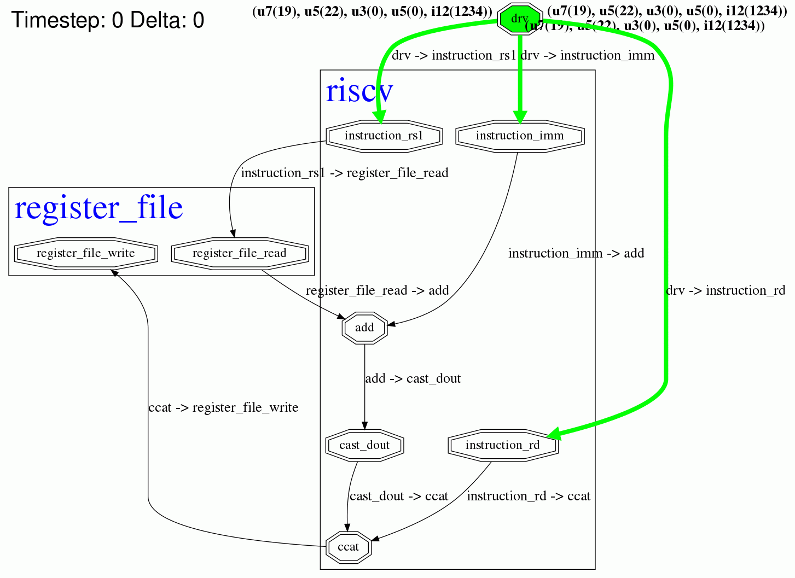

My First Instruction
====================

.. post::
   :author: Bogdan
   :category: RISC-V

.. _RISC-V ISA Specification: https://content.riscv.org/wp-content/uploads/2017/05/riscv-spec-v2.2.pdf

.. verbosity_slider:: 2

:v:`2` First instruction is probably going to be unlike any other in the amount of work that I'll need to put into implementing it, so it deserves a post on its own. :v:`1` Let's start from the RV32I description in the (currently) latest version of the `RISC-V ISA Specification`_, which is given in the `Chapter 2: RV32I Base Integer Instruction Set <https://content.riscv.org/wp-content/uploads/2017/05/riscv-spec-v2.2.pdf#page=21>`_. The specification first goes on to describe `Integer Computational Instructions (Chapter 2.4) <https://content.riscv.org/wp-content/uploads/2017/05/riscv-spec-v2.2.pdf#page=25>`_, of which the ``addi`` instruction is explained first, so let's start with that one.

All RV32I instructions are encoded with 32 bits using several formats (although there is also a `Compressed Instruction Formats (Chapter 12.2) <https://content.riscv.org/wp-content/uploads/2017/05/riscv-spec-v2.2.pdf#page=81>`_ but I'll leave that for later). All the information needed for the instruction execution have to be encoded in 32 bits and formats specify where exactly is each peace of information located within these 32 bits. Usually the instruction needs to specify which operation to perform, which registers are involved (``rs`` - register source or ``rd`` - register destination), and usually provides some immediate values as arguments (``imm`` fields). One of the key advantages of the RISC-V ISA is that peaces of information of the same type (like ``rd`` field) are usually located at the same position within the 32 bit encoding for different formats, which proved to simplify the hardware implementation.

For RV32I, a set of 32 registers is needed, named ``x0`` - ``x31``, where ``x0`` is different from the others in that it has a fixed value of 0, i.e it's value cannot be changed. The ISA specification defines the ``XLEN`` parameter to represent the width of the registers in number of bits: either 32 or 64. I'll try to keep ``XLEN`` a design parameter of the processor implementation, but I'll first focus on a version with ``XLEN=32``, i.e with the processor version with 32 bit wide registers.

Instruction format
------------------

The ``addi`` instruction has an "Integer Register-Immediate" format, aka the "I-type" format shown on the image below. The instruction is executed by adding the value of the 12 bit immediate field ``imm`` to the value read from the register specified by the ``rs1`` field. The result is then truncated to ``XLEN`` bits and stored into the register specified by the ``rd`` field. 

.. figure:: images/integer-register-immediate-instruction.png
   :align: center

   "Integer Register-Immediate" instruction format, aka the "I-type" format, from the `RISC-V ISA Specification`_

Since the instruction encodings have fields that serve different purposes from one another, I'll represent the instruction with the :any:`typing/tuple` PyGears type. The :any:`typing/tuple` type represents a generic heterogenous container type akin to records and structs in other HDLs, and I can specify the names and types of the fields by providing in square brackets a Python dict where field names are mapped to the field types. For the "I-type" instructions, I ended-up with a following definition in PyGears::

  TInstructionI = Tuple[{
      'opcode': Uint[7],
      'rd'    : Uint[5],
      'funct3': Uint[3],
      'rs1'   : Uint[5],
      'imm'   : Int[12]
  }]

The ``opcode`` and ``funct3`` fields determine the function to be executed, and ``rd``, ``rs1`` and ``imm`` fields carry the function arguments. The ``opcode`` and ``funct3`` fields store the ID of the function, so I can represent them with an unsigned number, i.e the :any:`typing/uint` PyGears type. Some enumerated type might constrain this fields better, since not all function IDs might be available in a specific processor implementation (after this blog post I will have implemented only one function - ``addi``). However, PyGears does't yet have enumerated types, so I'll use the :any:`typing/uint` type as the second best.

Values of the ``rs1`` and ``rd`` fields contain the IDs of the registers involved, hence they are 5 bit wide so that they can encode all 32 register IDs, hence they are represented by the :any:`Uint[5] <typing/uint>` type. ISA specifies that ``addi`` as a signed operation, and that the values in the ``imm`` field are encoded as signed integers, so I'll use :any:`Int[12] <typing/int>` type here.

Now any gear that operates on the ``imm`` field can, if needed, automatically adjust its operation to handle the signed numbers correctly, and I don't have to worry about it for every gear excplicitely. This is a major advantage of the typing system, since I can express my intents using the type (like with :any:`Int <typing/uint>` here) in a single place in the code, and this intent will propagate automatically throughout the design. Traditional HDLs offer only rudimentary typing support, so you need to follow you signals around and explictely. However, just specifying the type is only a half of the story. The other half lies in providing the Polymorphic behavior for the modules, so that they automatically accomadate for different data types.

OK, so now we have the ``TInstructionI`` type, that describes the general format for the "I-type" instructions, and my ``addi`` instruction will be an instance of this type. As I said, ``opcode`` and ``funct3`` will have unique, specific value for the ``addi`` instruction which is specified by ISA. I had to consult `Chapter 19: RV32/64G Instruction Set Listings <https://content.riscv.org/wp-content/uploads/2017/05/riscv-spec-v2.2.pdf#page=115>`_ in order to get the correct values for the function ID fields: ``opcode=0x13`` and ``funct3=0x0``. 

.. figure:: images/addi-instruction-field-value.png
    :align: center

    ``addi`` instruction format, from `RISC-V ISA Specification`_

Other instruction fields: ``rd``, ``rs1`` and ``imm``, can take arbitrary values, so I can't fix those in advance. This gives me the following template for the ``addi`` instruction:: 

  OPCODE_IMM = 0x13
  FUNCT3_ADDI = 0x0

  ADDI = TInstructionI({
      'opcode': OPCODE_IMM,
      'rd'    : 0,
      'funct3': FUNCT3_ADDI,
      'rs1'   : 0,
      'imm'   : 0
  })

Since PyGears doesn't have templates for type instances, all I can do is assign some default values to the fields whose values can change. Maybe its worth considering whether true generic templates (with generic parameters) for the type instances would add anything of value (or researching if there are languages that support these). In that case, instead of zeros above, the fields would be assigned some template placeholder names, that would need to be assigned values later. Prolog does something like that?

Processor implementation
------------------------

Since the idea of this blog series is to show how one can evolve a complex hardware design using PyGears without wasted effort, by implementing one feature at a time, I will turn a blind eye to the fact that RISC-V processor needs to support multiple instructions at this moment. I will exclude the PC manipulation functionality, which gets important once jump instructions get into play, and the interface to the data memory, which gets important once load and store instructions git into play. For now I will move the `register file <https://github.com/bogdanvuk/pygears_riscv/blob/afb23407150fe43d53c3df1340a93e2f2644d741/pygears_riscv/verif/register_file.py>`__ outside the processor into a separate module and implement it in pure Python to ease reading and writing for the verification purposes. Later, I'll provide an RTL implementation of the register file, but it is a simple module and it should be a straightforward design process, so I don't feel like cheating for postponing it. Without further ado, this single-instruction capable RISC-V processor written in PyGears looks like this::

  @gear
  def riscv(instruction: TInstructionI, reg_data: Uint['xlen']):

      reg_file_rd_req = instruction['rs1']

      add_res = ((reg_data | Int) + instruction['imm']) | reg_data.dtype
      reg_file_wr_req = ccat(instruction['rd'], add_res)

      return reg_file_rd_req, reg_file_wr_req

Let's dig deeper into those 6 lines of code. The ``@gear`` statement is called a decorator in Python terminology. If it is placed in front of the function definition it can wrap it with some additional code. The ``@gear`` decorator is where most of the magic happens in PyGears. It makes a function composable via  '|' (pipe) operator, it performs type checking and matching, it instantiates a new hardware module each time the function is called, it takes care about module hierarchy, etc.

Next, the `function prototype <https://en.wikipedia.org/wiki/Function_prototype>`__  declares the types of input interfaces the ``riscv`` gear accepts, namely: ``instruction: TInstructionI`` and ``reg_data: Uint['xlen']``. 

    ``addi`` instruction simulation timelapse. Each frame is a single delta cycle.

I had to consult `Chapter 20 <https://content.riscv.org/wp-content/uploads/2017/05/riscv-spec-v2.2.pdf#page=121>`_ in order to find the mapping from the ``x*`` register names to their `ABI <https://en.wikipedia.org/wiki/Application_binary_interface>`__ equivalents which are used by the Spike simulator. This chapter also gives examples of the assembly syntaxes for the instructions. Also `psABI <https://github.com/riscv/riscv-elf-psabi-doc/blob/master/riscv-elf.md>`__ 

Tried ``li`` approach, but failed with::
  terminate called after throwing an instance of 'std::runtime_error'
    what():  misaligned address

`this guide <https://github.com/riscv/riscv-asm-manual/blob/master/riscv-asm.md>`__, finally succeeded with "Constant".
