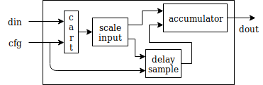
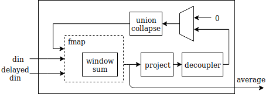

.. _section-example:

An example: Moving Average Filter
=================================

Implementation
--------------

[Omitted long line with 1 matches]

.. math:: y[i] = \frac{1}{M} \sum_{j = 0}^{M - 1}x[i + j]
   :label: filt_formula

The simplified block diagram of the developed gear is given on :numref:`moving-average-bd`.

   Block diagram of the moving average gear

The filter has two input interfaces (one used for configuration and the other for data) and has a single output interface. As with every gear, the interfaces are typed. The configuration carries two values: averaging coefficient and the size of the window, and is represented as a ``Tuple`` data type. The second input is used for streaming the data and is represented as a ``Queue`` data type. Compile time parameters of the moving average gear include the data width, shift amount and the maximum filter order. The interface definition of the ``moving_average`` gear using PyGears is given below. Since this is a hierarchical gear the output interface type is determined by the return statement and need not be specified.

.. raw:: latex

    \begin{lstlisting}[language=python]
    @gear
    def moving_average(
        cfg: Tuple[{'avg_coef'  : Int['W'],
                    'avr_window': Uint['W']}],
        din: Queue[Int['W']],
        *,
        W=b'W', shamt=15, max_filter_ord=1024):

        scaled_sample = cart(cfg['avg_coef'], din) \
            | fmap(f=scale_input(shamt=shamt, W=W),
                   fcat=czip)

        delayed_din = delay_sample(
            scaled_sample,
            cfg['avr_window']
            W=W,
            max_filter_ord=max_filter_ord)

        return accumulator(
                   scaled_sample, delayed_din, W=W)

    \end{lstlisting}

The filter operates as follows. Each data sample received at ``din`` input interface is first scaled by the averaging coefficient received at the ``cfg`` input interface. Since each element of the ``Queue`` needs to be multiplied, we first create a ``Queue`` of ``Tuples`` (more precisely ``Queue[Tuple[Int['W'], Int['W']]]``), whose each item is a following pair of values: (averaging coefficient, input sample) represented by the ``Tuple`` type. This is done by replicating the averaging coefficient (``cfg['avg_coef']`` in the code) for each data sample with the builtin ``cart`` gear, which automatically performs replication based on its input data types. Data formed in this way are then sent to the ``scale_input`` gear which multiplies the two elements of the pair and shifts the resulting data to restore the fixed-point format. In PyGears the function composition and thus the connection between the gears can be described using pipe "``|``" operator. The ``scale_input`` gear operates on the ``Tuple`` data types, not on the ``Queues`` of ``Tuples`` output by the ``cart`` operation. In order to compose these gears nevertheless, a functor mapping can be utilized implemented by the ``fmap`` gear. The ``fmap`` gear will send each element of the input ``Queue`` to the ``scale_input`` gear, and then pack its outputs again in a ``Queue`` data type. Usage of this functor allows ``scale_input`` to be an independent gear with a single responsibility, which can be easily reused in multitude of contexts. Functors are powerful patterns for gear composition that significantly improve possibilities for gear reuse. There is one functor for each complex data type. Functors allow for gears that operate on simpler data types to be used in context where a more complex data type is needed.

Each new sample scaled in this way is then added to the window sum. In order to generate a new window sum from the previous window sum, the first sample of the previous window needs to be subtracted from the accumulated sum since it is not in the window any more. The accumulation takes place in the ``accumulator`` gear, while the ``delay_sample`` gear is used to provide the samples to be subtracted from the sum at appropriate times, as given in the definition of ``moving_average``. Since the ``scaled_sample`` interface needs to be connected to both the ``accumulator`` and the ``delay_sample`` gears, additional data broadcasting logic is needed to ensure the correct synchronization between the gears. In PyGears this is done automatically.

   Accumulator gear block diagram

The ``accumulator`` gear, whose block diagram is shown in :numref:`accumulator-bd` and its PyGears implementations shown below, contains a feedback loop that cannot be described as a plain gear composition since it forms a cycle. This cycle needs to be cut at one spot, described as the gear composition, and then joined together. The ``prev_window_sum`` interface is first defined without its producer gear and passed to the ``window_sum`` gear, then later connected to the output of the composition of the ``priority_mux`` and ``union_collapse`` gears.

The ``window_sum`` gear calculates the output average for one input sample at a time, but the data received at ``din`` is a ``Queue`` of samples, so an ``fmap`` needs to be used to connect the two. This is similar to how an ``fmap`` was used to connect the ``scale_input`` gear in ``moving_average``. The result of the ``window_sum`` calculation is both sent to the output and used to form the ``prev_window_sum``. The ``average`` interface is first connected to the ``project`` and ``decoupler`` gears, which discard the ``Queue`` (transaction) information and register the data. The ``priority_mux`` gear and the constant source of zeros: ``Int[W](0)``, are used to either pass a zero value (for the first sample) or the value from the ``average_reg`` interface.

.. raw:: latex

   \begin{lstlisting}[language=python]
   @gear
   def accumulator(din, delayed_din, *, W):
       prev_window_sum = Intf(Int[W])
   
       average = din \
           | fmap(f=window_sum(prev_window_sum,
                               delayed_din),
                  fcat=czip)
   
       average_reg = average \
           | project \
           | decoupler
   
       prev_window_sum |= priority_mux(average_reg,
                                       Int[W](0)) \
           | union_collapse
   
       return average

   \end{lstlisting}

The ``window_sum`` gear maintains the current window sum by adding a new input sample and subtracting the sample that is no longer in the averaging window, and its implementation in PyGears is shown below. All major arithmetic operators are supported by PyGears.

.. raw:: latex

   \begin{lstlisting}[language=python]
   @gear
   def window_sum(din, add_op, sub_op):
       return din + add_op - sub_op
   \end{lstlisting}

Results
-------

In this chapter we provide comparison between: PyGears, Vivado HLS and RTL implementations :cite:`MovingAverage`, in terms of the utilization and maximum attainable frequencies. Based on the python description of the ``moving_average`` gear, PyGears generates a SystemVerilog description. All implementations of the developed IP core were done using Xilinx's Vivado 2018.2 tool, with Zynq-7020 as the target FPGA device. The most interesting implementation results, regarding used hardware resources for the sample width of 16 bits (``W = 16``) and the maximum filter order of 1024, are presented in :numref:`tbl-utilization`.

.. tabularcolumns:: |l|r|r|r|r|r|

.. list-table:: FPGA resources required to implement the moving average core
    :name: tbl-utilization
    :header-rows: 1

    * - Implementation
      - LUTs
      - FFs
      - BRAMs
      - DSPs
      - Fmax [MHz]
    * - PyGears
      - 102
      - 91
      - 0.5
      - 1
      - 168.60
    * - RTL
      - 63
      - 58
      - 0.5
      - 1
      - 155.95
    * - Vivado HLS
      - 248
      - 183
      - 0.5
      - 1
      - 181.79

As expected, the RTL implementation is the most efficient regarding the resource utilization since it builds the most cohesive but also the most coupled system. Nevertheless, PyGears implementation strikes an excelent balance between the RTL and HLS, by providing a convinience of writting at a high level of abstraction without a significant drop in performance. Moreover, the HLS implementation failed to achieve the desired throughput of 1 sample per clock cycle despite the optimization directives that were provided. That is, PyGears offers better controllability over the final result than HLS, which allows achieving performances closer to RTL.  
