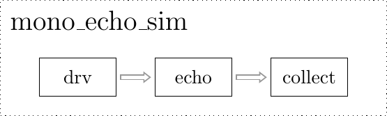

..  _echo-examples:

Echo
====

This example shows how to use PyGears to implement a hardware module that applies echo audio effect to a continuous audio stream. For a more detailed explanation of PyGears features used in this example, you can checkout a :ref:`quick introduction to PyGears <introduction>`.

The hardware module is part of the `pygears_dsp <https://github.com/bogdanvuk/pygears-dsp>`_ library and is defined in `pygears_dsp/examples/echo/echo.py <https://github.com/bogdanvuk/pygears-dsp/blob/master/pygears_dsp/examples/echo/echo.py>`_. Its block diagram is given below. You can checkout the :ref:`functional description <examples-echo-functional-description>` of the ``echo`` module. In-depth explanation of the PyGears description of the echo model given in :ref:`hardware description <examples-echo-hardware-description>` chapter. PyGears takes the Python module description and compiles it to SystemVerilog which is :ref:`listed below<echo-sv>`.

.. image:: images/echo.png
    :align: center

SystemVerilog Generation
------------------------

Run the script `pygears_dsp/examples/echo/echo_svgen.py <https://github.com/bogdanvuk/pygears-dsp/blob/master/pygears_dsp/examples/echo/echo_svgen.py>`_ in order to let PyGears generate SystemVerilog files.

.. code-block:: bash

  cd <pygears_dsp_source_dir>/pygears_dsp/examples/echo
  python echo_svgen.py

If you have `Vivado <https://www.xilinx.com/products/design-tools/vivado.html>`_ installed (you can download a free WebPack version from Xilinx website), the script will automatically try to synthesize the design and display the resource utilization report (displayed also :ref:`below <examples-echo-resource-utilization>`).

Running Simulation
------------------

Run the script `pygears_dsp/examples/echo/plop_test_wav_echo_sim.py <https://github.com/bogdanvuk/pygears-dsp/blob/master/pygears_dsp/examples/echo/plop_test_wav_echo_sim.py>`_ to run a simulation of the ``echo`` module. The simulation is run with the help of the Verilator tool, so please checkout the :ref:`installation instructions <install>` if you need help with installing the Verilator. Furthermore, if you would like to see plots of the audio waves, you need to install `matplotlib <https://matplotlib.org/>`_. You can run the echo example like this:

.. code-block:: bash

  cd <pygears_source_dir>/examples/echo
  python plop_test_wav_echo_sim.py

Upon starting the script, the following info should be displayed:

.. code-block:: bash

  Audio file "plop.wav":

      Channels     : 2
      Framerate    : 48000
      Sample width : 2 Bytes
      Sample num   : 165359

  -  [INFO]: Running sim with seed: ...
  0 /echo [INFO]: Verilating...
  0 /echo [WARNING]: Verilator compiled with warnings. Please inspect "..."
  0 /echo [INFO]: Verilator VCD dump to "..."
  0 /echo [INFO]: Done
  0  [INFO]: -------------- Simulation start --------------
  165459  [INFO]: ----------- Simulation done ---------------
  165459  [INFO]: Elapsed: 31.78
  Result length: 165359

Upon completion, the resulting wave will be saved in the file ``build/plop_echo.wav``. If you installed matplotlib, the plots of the original and the resulting audio waves should be displayed.

.. image:: images/echo_plot.png

Simulation log will display path to the simulation wave file in standard VCD. Wave can be viewed for an example with an open-source tool `GTKWave <http://gtkwave.sourceforge.net/>`_.

.. image:: images/echo_vcd.png

You can now play with the parameters in ``plop_test_wav_echo_sim.py`` script. Try changing echo delay and gain settings and check the results.  

Stereo Echo
-----------

PyGears lets you easily compose gears at any level. To create a stereo echo effect gear, we will instantiate one ``echo`` gear for each channel.

.. image:: images/stereo_echo.png
    :align: center

In PyGears this can be described as follows:

.. literalinclude:: ../../../pygears-dsp/pygears_dsp/examples/echo/echo.py
   :pyobject: stereo_echo

The input interface ``din`` of the ``stereo_echo`` module, needs to carry two samples, one for each channel. This can be represented as a ``Tuple`` data type. If the samples are 16 bits wide, the stereo data should be of the type ``Tuple[Int[16], Int[16]]``, which can be displayed more succinctly as ``(i16, 116)``. Other parameters of the ``stereo_echo`` gear have the same meaning as the ``echo`` gear parameters.

First, a version of echo gear is created, with some of its parameters supplied/set. This is akin to the `partial function application <https://en.wikipedia.org/wiki/Partial_application>`_::

    mono_echo = echo(feedback_gain=feedback_gain,
                     sample_rate=sample_rate,
                     delay=delay)

The ``mono_echo`` variable now points to the ``echo`` gear, but also carries the information about parameter settings for ``feedback_gain``, ``sample_rate`` and ``delay``. Even though the ``echo`` function seems to be called, it will not be instantiated at this moment. The reason is that the input interface ``din`` was not connected, i.e. it has not been supplied as a parameter. PyGears will instantiate a gear only when all of its input interfaces are supplied.

Next, the input interface ``din`` is connected to the two ``echo`` gears. For this we will rely on ``tuplemap`` to split the data from ``din`` into two components, feed each of the components to the individual ``echo`` gear, and then combine the result. In more functional terms, ``tuplemap`` applies the ``echo`` functions to each item of the ``din`` data tuple. Checkout a :ref:`short presentation <gears-functors>` of useful functors used in PyGears.

.. code-block:: python

    return din | tuplemap(f=(mono_echo, mono_echo))

The output interface of the ``tuplemap`` gear will also be output interface of the ``stereo_echo`` gear.

You can run the cosimulation of the stereo design by setting ``stereo=True`` in `examples/echo/plop_test_wav_echo_sim.py <https://github.com/bogdanvuk/pygears/blob/develop/examples/echo/plop_test_wav_echo_sim.py>`_. 

..  _examples-echo-functional-description:

Functional description
----------------------

The ``echo`` module operates as follows: audio samples arrive at the ``echo`` module input ``din``, echo is added and the resulting samples are output to the module output ``dout``. In PyGears terms this is a single-input, single-output gear (function), with the following declaration:  

.. autofunction:: echo.echo

As you can see the ``echo`` gear has few more parameters besides ``din``: ``feedback_gain``, ``sample_rate`` and ``delay``. These are declared after the '*' symbol, which makes them keyword-only arguments in Python, which in turn makes them **compile-time parameters** in PyGears. These are akin to HDL parameters or generics.

Notice that the ``din`` argument has also a type associated with it, namely a template ``Int['W']`` which represents signed integers of arbitrary width. Take a look at the :ref:`short explanation <typing>` on how types are used in PyGears. :class:`~pygears.typing.uint.Int` type is generic in the number of bits, hence ``echo`` gear can work on samples of arbitrary width. The actual width of the input will be set by ``echo`` gear parent, i.e the module that instantiates ``echo``:

.. literalinclude:: ../../../pygears-dsp/pygears_dsp/examples/echo/wav_echo_sim.py
   :pyobject: wav_echo_sim
   :emphasize-lines: 34-40

In ``wav_echo_sim()`` function, ``drv`` gear is used to drive audio samples to the ``echo`` gear, which in turn sends the result to the ``collect`` gear. In PyGears the connection from ``drv`` to ``echo`` can be described using pipe '|' operator. The ``drv`` gear sends the sequence of audio samples (variable ``seq``), by first converting them to the specified data type: ``Fixp[1, sample_bit_width]``, where ``sample_bit_width`` value is calculated based on the input wave file format.

At compile time, PyGears will try to match output data type of ``drv`` gear: ``Fixp[1, sample_bit_width]`` to the input data type ``Fixp`` of the ``echo`` gear, and since that their base types (:class:`~pygears.typing.fixp.Fixp`) match PyGears will allow the connection.   

Conveniently, ``echo`` gear accepts also some floating point arguments, but these then need to be converted in order to be used for parametrizing hardware modules. This is done at the beginning of the function:

.. literalinclude:: ../../../pygears-dsp/pygears_dsp/examples/echo/echo.py
   :pyobject: echo
   :lines: 24-27

Since echo delay is given in seconds, it needs to be calculated in terms of the number of samples: variable ``sample_dly_len`` in the code. Then, feedback loop fifo needs to be deep enough to store the delayed samples. Current implementation of the fifo module in PyGears demands its depth to be a power of 2. Hence, function ``ceil_pow2`` is used to calculate the smallest power of 2 that can accommodate selected delay: variable ``fifo_depth`` in the code.

Feedback loop gain is also given as a floating point number and needs to be converted to its fixed-point representation: variable ``feedback_gain_fixp``. Width of the fixed-point gain is chosen to be equal to the width of the audio samples received at ``din``, which will be available via the ``sample_width`` argument. Calculated fixed-point value is then cast to the type of the *din* interface: ``feedback_gain_fixp = din.dtype(...)``. 

..  _examples-echo-hardware-description:

Hardware description
--------------------

After the compile-time parameters calculation in the ``echo`` function, the description of the actual hardware is given.

.. literalinclude:: ../../../pygears-dsp/pygears_dsp/examples/echo/echo.py
   :pyobject: echo
   :lines: 33-

.. image:: images/echo.png
    :align: center

The feedback loop, present in the design, cannot be described as a plain gear composition since it forms a cycle. This cycle needs to be cut at one spot, described as the gear composition and then stitched together. In this example, we will cut the cycle after the adder and start by defining the interface ``dout``:: 

  dout = Intf(din.dtype)

At this moment, this interface has no source (producer), which has to be attended to later, when we stitch the cycle. We will now connect ``dout`` interface to the FIFO, which we will in turn connect to the Fill Void gear::

    feedback = dout \
        | decouple(depth=fifo_depth) \
        | prefill(dtype=din.dtype, num=sample_dly_len)

The function of the prefill gear is to supply the feedback loop with zeros until there are enough samples (``sample_dly_len`` of them) in the FIFO, at which moment the FIFO will start outputting the delayed samples. The definition of the prefill gear is given in the same file:: 

    @gear
    def prefill(din, *, num, dtype):
        fill = once(val=dtype(0)) \
            | replicate(num) \
            | flatten

        return priority_mux(fill, din) \
            | union_collapse

The ``priority_mux`` gives priority to the ``din`` interface over the ``fill`` interface. In other words, if the data is available at the ``din`` interface, it will be passed to the output of the ``priority_mux`` gear. Otherwise, the data from the ``fill`` interface is output. ``priority_mux`` also outputs some additional information (i.e. from which input interface the data was passed) which is not needed here, so ``union_collapse`` gear is used to filter it out. 

Back to the ``echo`` function. Finally the output interface of the ``prefill`` gear is assigned to the variable ``feedback``. This variable can now be used to connect this interface to the multiplier:: 

  feedback_attenuated = trunc(feedback * feedback_gain_fixp, t=din.dtype)

The output of the multiplier is then connected to the SHR gear, whose output interface is in turn assigned to the variable ``feedback_attenuated``. Adder is then instantiated and ``din`` and ``feedback_attenuated`` interfaces are connected to it. Multiplication, shifting and addition operations change the bit width of the data, so we need restore the width of the data to the input data width. This is done by the cast to the input data type ``din.dtype``. Finally, we stitch the feedback cycle back, by connecting the output interface of the adder to the previously declared ``dout`` interface::   

  dout |= trunc(din + feedback_attenuated, t=dout.dtype)

At the end of the ``echo`` function implementation, we declare which of the interfaces will be output outside of the ``echo`` gear::

  return dout

Given description of the ``echo`` gear is translated by the PyGears into the SystemVerilog module given below:

..  _echo-sv:

Generated SystemVerilog
-----------------------

.. code-block:: systemverilog

    module echo(
        input logic clk,
        input logic rst,

        dti.consumer din, // q1.15 (16)
        dti.producer dout // q1.15 (16)

    );

    /*verilator tracing_off*/

          dti #(.W_DATA(16)) trunc11_s(); // q1.15 (16)
          dti #(.W_DATA(16)) trunc11_s_bc[1:0](); // q1.15 (16)
        bc #(
            .SIZE(2'd2)
        )
        bc_trunc11_s (
            .clk(clk),
            .rst(rst),
            .din(trunc11_s),
            .dout(trunc11_s_bc)
        );

        assign dout.valid = trunc11_s_bc[1].valid;
        assign dout.data = trunc11_s_bc[1].data;
        assign trunc11_s_bc[1].ready = dout.ready;

          dti #(.W_DATA(16)) decouple1_s(); // q1.15 (16)

          dti #(.W_DATA(16)) prefill1_s(); // q1.15 (16)

          dti #(.W_DATA(16)) const1_s(); // q1.15 (16)

          dti #(.W_DATA(32)) ccat01_s(); // (q1.15, q1.15) (32)

          dti #(.W_DATA(32)) mul1_s(); // q2.30 (32)

          dti #(.W_DATA(16)) trunc01_s(); // q1.15 (16)

          dti #(.W_DATA(32)) ccat11_s(); // (q1.15, q1.15) (32)

          dti #(.W_DATA(17)) add1_s(); // q2.15 (17)

        echo_decouple decouple (
            .clk(clk),
            .rst(rst),
            .din(trunc11_s_bc[0]),
            .dout(decouple1_s)
        );

        echo_prefill prefill (
            .clk(clk),
            .rst(rst),
            .din(decouple1_s),
            .dout(prefill1_s)
        );

        echo_ccat0 ccat0 (
            .clk(clk),
            .rst(rst),
            .din0(prefill1_s),
            .din1(const1_s),
            .dout(ccat01_s)
        );

        sustain #(
            .VAL(15'd19661),
            .TOUT(5'd16)
        )
        const_i (
            .clk(clk),
            .rst(rst),
            .dout(const1_s)
        );

        echo_mul mul (
            .clk(clk),
            .rst(rst),
            .din(ccat01_s),
            .dout(mul1_s)
        );

        echo_trunc0 trunc0 (
            .clk(clk),
            .rst(rst),
            .din(mul1_s),
            .dout(trunc01_s)
        );

        echo_ccat1 ccat1 (
            .clk(clk),
            .rst(rst),
            .din0(din),
            .din1(trunc01_s),
            .dout(ccat11_s)
        );

        echo_add add (
            .clk(clk),
            .rst(rst),
            .din(ccat11_s),
            .dout(add1_s)
        );

        echo_trunc1 trunc1 (
            .clk(clk),
            .rst(rst),
            .din(add1_s),
            .dout(trunc11_s)
        );

    endmodule

..  _examples-echo-resource-utilization:

Resource Utilization
--------------------

If you have Vivado tool on your path while running the `pygears_dsp/examples/echo/echo_svgen.py <https://github.com/bogdanvuk/pygears-dsp/blob/master/pygears_dsp/examples/echo/echo_svgen.py>`_ script, the following report will be produced. Some of the ``echo`` submodules are missing from the list, since Vivado tried to merged the modules in order to reduce the resource utilization.

+----------------------+------------+------------+---------+------+-----+--------+--------+--------------+
|       Instance       | Total LUTs | Logic LUTs | LUTRAMs | SRLs | FFs | RAMB36 | RAMB18 | DSP48 Blocks |
+----------------------+------------+------------+---------+------+-----+--------+--------+--------------+
| wrap_echo            |         88 |         88 |       0 |    0 |  72 |      8 |      0 |            1 |
+----------------------+------------+------------+---------+------+-----+--------+--------+--------------+
| - echo_i             |         88 |         88 |       0 |    0 |  72 |      8 |      0 |            1 |
+----------------------+------------+------------+---------+------+-----+--------+--------+--------------+
| - - add_i            |         16 |         16 |       0 |    0 |   0 |      0 |      0 |            0 |
+----------------------+------------+------------+---------+------+-----+--------+--------+--------------+
| - - bc_dout_s        |          5 |          5 |       0 |    0 |   2 |      0 |      0 |            0 |
+----------------------+------------+------------+---------+------+-----+--------+--------+--------------+
| - - decouple_i       |         24 |         24 |       0 |    0 |  38 |      0 |      0 |            0 |
+----------------------+------------+------------+---------+------+-----+--------+--------+--------------+
| - - fifo_i           |         42 |         42 |       0 |    0 |  30 |      8 |      0 |            0 |
+----------------------+------------+------------+---------+------+-----+--------+--------+--------------+
| - - fill_void_i      |          1 |          1 |       0 |    0 |   2 |      0 |      0 |            0 |
+----------------------+------------+------------+---------+------+-----+--------+--------+--------------+
| - - - priority_mux_i |          1 |          1 |       0 |    0 |   2 |      0 |      0 |            0 |
+----------------------+------------+------------+---------+------+-----+--------+--------+--------------+
| - - mul_i            |          0 |          0 |       0 |    0 |   0 |      0 |      0 |            1 |
+----------------------+------------+------------+---------+------+-----+--------+--------+--------------+
