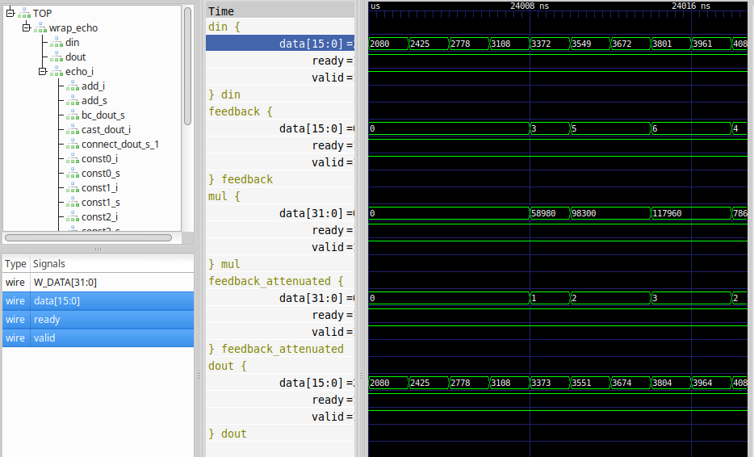

.. _get_started:

PyGears get started
===================

Contents
--------
.. toctree::
   :maxdepth: 4

   get_started

PyGears Overview
----------------
**PyGears** is a free framework that lets you design hardware using high-level Python constructs and compile it to synthesizable SystemVerilog or Verilog code. There is a built-in simulator that lets you use arbitrary Python code with its vast set of libraries to verify your hardware modules. **PyGears** makes connecting modules easy, and has built-in synchronization mechanisms that help you build correct parallel systems.

.. code-block:: python

  @gear
  def echo(samples: Fixp, *, feedback_gain, sample_rate, delay):

      sample_dly_len = round(sample_rate * delay)
      fifo_depth = ceil_pow2(sample_dly_len)
      feedback_gain_fixp = samples.dtype(feedback_gain)

      dout = Intf(samples.dtype)

      feedback = decouple(dout, depth=fifo_depth) \
          | prefill(dtype=samples.dtype, num=sample_dly_len)

      feedback_attenuated = (feedback * feedback_gain_fixp) \
          | samples.dtype

      dout |= (samples + feedback_attenuated) | samples.dtype

      return dout

Python functions model hardware modules, where function arguments represent module inputs and parameters. Example ``echo`` module has a single input port called ``samples`` where data of arbitrary signed fixed-point type ``Fixp`` can be received. Other three parameters ``feedback_gain``, ``sample_rate`` and ``delay`` are compile time parameters.

.. code-block:: python

  @gear
  def echo(samples: Fixp, *, feedback_gain, sample_rate, delay):
      ...

Arbitrary Python code can be used in modules at compile time, for an example to transform input parameters:

.. code-block:: python

    sample_dly_len = round(sample_rate * delay)
    fifo_depth = ceil_pow2(sample_dly_len)
    feedback_gain_fixp = samples.dtype(feedback_gain)

Rest of the ``echo`` function code describes the hardware module for applying echo audio effect to the input stream. 

.. image:: images/echo.png
    :align: center

Modules are instantiated using function calls: ``decouple(dout, depth=fifo_depth)``, which return module output interfaces that can in turn be passed as arguments to other module functions in order to make a connection between the modules. For convenience the pipe ``"|"`` operator can be used to pass output of one function as argument to the next one. This was used to connect the output of ``decouple`` to ``prefill`` (``"\"`` is used just to split the line visually):

.. code-block:: python

    feedback = decouple(dout, depth=fifo_depth) \
        | prefill(dtype=samples.dtype, num=sample_dly_len)

Again, the ``echo`` function returns its output interfaces which is then used to establish the connection with the next module that received the ``echo`` output stream:

.. code-block:: python

  @gear
  def echo(...):
      ...
      return dout

Built-in simulator makes it easy to test and verify the modules while drawing power from the Python vast ecosystem of libraries. For an example, use Python built-in `audioop <https://docs.python.org/3.7/library/audioop.html>`_ library to read WAV files into an input samples stream for the ``echo`` module, and then visualise the input and output waveforms using `matplotlib <https://matplotlib.org/>`_:

.. image:: images/echo_plot.png

Speedup the simulation by configuring **PyGears** simulator to use open-source `Verilator <http://www.veripool.org/wiki/verilator>`_ to simulate hardware modules, or some of the proprietary simulators like Questa, NCSim or Xsim. Implement any part of the system in a standard HDL and debug your design by inspecting the waveforms for an example in open-source wave viewer `GTKWave <http://gtkwave.sourceforge.net>`_ 

Checkout :ref:`Echo example description <echo-examples>` for more in depth information about the ``echo`` example.

PyGears introduction for beginners
----------------------------------
This section of documentation is meant for software and hardware engineers who are new in **PyGears** world.

Description
~~~~~~~~~~~
This document is intended to give you a quick overview of the **PyGears** framework, along with pointers to further documentation. It is intended as a "bootstrap" guide for those who are new to the framework, and provides just enough information for you to be able to read other peoples' **PyGears** and understand roughly what it's doing, or write your own simple modules.

This introductory document does not aim to be complete. It does not even aim to be entirely accurate. In some cases perfection has been sacrificed in the goal of getting the general idea across. You are strongly advised to follow this introduction with more information from the full **PyGears** manual, the table of contents to which can be found in :ref:`Reference manual <reference>`.

Throughout this document you'll see references to other parts of the **PyGears** documentation.

Throughout **PyGears'** documentation, you'll find numerous examples intended to help explain the discussed features. Please keep in mind that many of them are code fragments rather than complete programs.

These examples often reflect the style and preference of the author of that piece of the documentation, and may be briefer than a corresponding line of code in a real program. 

Do note that the examples have been written by many different authors over a period of several years. Styles and techniques will therefore differ, although some effort has been made to not vary styles too widely in the same sections. Do not consider one style to be better than others. After all, in your journey as a programmer, you are likely to encounter different styles.

What is PyGears?
~~~~~~~~~~~~~~~~

Running PyGears design
~~~~~~~~~~~~~~~~~~~~~~

Quick introduction
~~~~~~~~~~~~~~~~~~
In this quick introduction, we will consider describing a gear that might be used as some kind of filter. It will feature two pipelined MAC operations and a multiplication at the end, and use three coefficients *b0*, *b1* and *b2* for the calculation::

  from pygears import gear

  @gear
  def filter(x, b0, b1, b2):
      x1 = mac(x, b0)
      x2 = mac(x1, b1)
      return x2 * b2

Notice the *@gear* decorator which will tells **PyGears** to treat this functions as a HDL module. It also allows for partial application and polymorphism which are not natively supported by the Python language.

The variables *x, b0, b1, b2, x1, x2* are interface objects and represent connections between modules. Input arguments *x, b0, b1, b2* correspond to the input ports of the HDL module. In **PyGears** the function call corresponds to the HDL module instantiation. The *mac* gear will return an interface object, as all gears are required to do. Returned interface object corresponds to the output port connection from the MAC module, and can be passed to some other gear which will make the connection from the MAC's output to the this gear's input. Additionally, **PyGears** interfaces support some of the Python operators ('*' in this example) and can be used to infer corresponding HDL modules. The above gear describes the following composition:
- first inputs *x* and *b0* are connected to the MAC module,
- output of the first MAC and the input *b1* are fed to the second MAC module,
- output of the second MAC is multiplied with *b2* which is connected to the output port of the *filter* module

*Filter* gear can now be used in the design, by calling it as a function and supplying the 4 arguments, which will in HDL terms instantiate the *filter* module. The output of the *filter* gear is directly the interface object returned by the multiplication operator.

If we have implementation of the MAC module in HDL, a gear wrapper needs to be provided, so that it can be used with **PyGears**::

  from pygears import gear
  from pygears.typing import Uint

  @gear
  def mac(a: Uint['w_a'], b: Uint['w_b']) -> Uint['w_a + w_b']:
      pass

For the gears that are implemented in HDL, return type needs to be specified so that **PyGears** can infer the output interface object type, as opposed to the *filter* gear description, where the multiplication submodule was responsible for forming the output interface object, and the *filter* only passed it through. A generic version of the *mac* gear is described above, where it accepts interfaces of variable sized unsigned integers - Uint type. Generic types are described by using strings ('w_a', 'w_b' and 'w_a + w_b') for some of its parameters. These strings are resolved differently for input and output types. For the input types, the strings are resolved when the gear is called and the supplied arguments are matched against parameterized type definitions. If the matching succeeds, the values for the parameters are extracted and can be used for resolving the output types. Uint['w_a'] type maps to a logic vector in HDL with length *w_a*. The output type will thus have the number of bits equal to the sum of *w_a* and *w_b*. If some a type other than Uint is supplied to *mac*, the exception will be raised.

Pipe operator
^^^^^^^^^^^^^

Infix composition operator '|', aka pipe, is also supported, hence the module can be rewritten as::

  from pygears import gear

  @gear
  def filter(x, b0, b1, b2):
      y = x | mac(b=b0) | mac(b=b1)
      return y * b2

This expression will unfold in the following manner:
- Two versions of the MAC gears will be prepared by using function partial application, one where *b0* is passed for its argument *b* and the other where *b1* is passed for its argument *b*. In terms of the HDLs, this corresponds to one MAC module with interface *b0* connected to its *b* port and the other with *b1* interface connected to its *b* port. MAC modules are not instantiated at this moment since they didn't receive all required arguments.
- Input *x* is piped to the first partially applied MAC gear and it is passed as its first argument *a*. At this moment, all required arguments are supplied to it, and *mac* gear is called. Types of the supplied arguments are checked, parameters and output type are resolved. Since *mac* gear contains no body, an interface object is created with the resolved output type and returned from the function.

Variable number of arguments
^^^^^^^^^^^^^^^^^^^^^^^^^^^^

Gears with variable number of arguments are supported using the Python mechanism for functions with variable number of arguments. Below an implementation of the variable size *filter* gear is given::

  from pygears import gear

  @gear
  def filter(x, *b):
      y = x
    for bi in b[:-1]:
        y = y | mac(b=bi)

      return y * b[-1]

Now, depending on the number of arguments supplied to the *filter* gear, corresponding number of MAC stages will be instantiated.

Gear parameters
^^^^^^^^^^^^^^^

Since all gear arguments are required to be interface objects, **PyGears** uses Python keyword-only argument mechanism to supply additional parameters to gears. In the following example, we will implement *filter* as a higher-order function, so that the filter stage can be implemented using an arbitrary gear, instead of it being fixed to the *mac* gear::

  from pygears import gear

  @gear
  def filter(x, *b, stage):
      y = x
      for bi in b[:-1]:
          y = y | stage(b=bi)

      return y * b[-1]

Gear parameters can be made optional, by supplying the default value::

  from pygears import gear

  @gear
  def filter(x, *b, stage=mac):
      y = x
      for bi in b[:-1]:
          y = y | stage(b=bi)

      return y * b[-1]

Type casting
^^^^^^^^^^^^

In the previous example, if *mac* gear is used, after each stage the interface size will increase, which is usually not the desired implementation. We can keep constant interface size by using type casting after each stage::

  from pygears import gear

  @gear
  def filter(x, *b, stage=mac):
      y = x
      for bi in b[:-1]:
          y = y | stage(b=bi) | x.dtype

      return y * b[-1]

Interface type can be accessed via its *dtype* attribute. Let's for the sake of an example leave-out the type cast of the last multiplication. Multiplication operator will increase the size of the output interface to accommodate for the largest possible multiplication product.

SystemVerilog generation
^^^^^^^^^^^^^^^^^^^^^^^^

SystemVerilog is generated by instantiating desired gears and calling **PyGears** *svgen* function. Here is an example of how this works for the *filter* gear::

  from pygears import gear, Intf
  from pygears.typing import Uint
  from pygears.hdl.sv import svgen

  @gear
  def mac(a: Uint['w_a'], b: Uint['w_b']) -> Uint['w_a + w_b']:
      pass

  @gear
  def filter(x, *b, stage=mac):
      y = x
      for bi in b[:-1]:
          y = y | stage(b=bi) | x.dtype

      return y * b[-1]

  x = Intf(Uint[16])
  b = [Intf(Uint[16])]*4

  iout = filter(x, *b)
  assert iout.dtype == Uint[32]

  svgen('/filter', outdir='~/filter_svlib')

Since we are only interested in generating SystemVerilog files for the *filter* gear, it will be the only gear we will instantiate. Since *filter* needs to be passed input interfaces, we will manually instantiate interface objects of the desired type and pass them to the *filter*. Output interface of the *filter* is not needed, and we only used it to check whether we got correct output type (which is of course optional). Since we called *filter* with four coefficient interfaces *b* and didn't supply an alternative to the default *mac* stage, we will get a *filter* implementation with four MAC stages.

**PyGears** will maintain a hierarchy of the instantiated gears in which each gear has been assigned a name. By default, gear instance gets the name of the function used to describe it. In this case, *filter* instance will be named 'filter'. Instances in the hierarchy can be accessed by via the path string. Path string follows the conventions of the Unix path syntax, where root '/' is auto-generated container for all the top gear instances (i.e. the ones not instantiated within other gears). In this case *filter* is one such gear, hence it is directly below root '/filter'. The *mac* gears are instantiated from within the *filter*, so their paths will be: '/filter/mac0', '/filter/mac1', '/filter/mac2' and '/filter/mac3'. So, if some gear instances have the same names on the same hierarchical level, their names will be suffixed with an increasing sequence of integers. Finally, it is possible to supply a custom name via gear *name* builtin parameter. This parameter is added by the *@gear* operator and need not be supplied in the function signature::

  filter(x, *b, name="filt")

Function *svgen* will generate needed hierarchical SystemVerilog modules with correct connections and instantiations of the submodules. In this example, HDL needs to be generated only for the *filter*. Other modules: *mac* and multiplication are already considered described in HDL. Hence, a single file 'filter.sv' will be generated inside '~/filter_svlib' folder.

Typing
~~~~~~

**PyGears** features a set of generic types that can be used to describe inputs and outputs of the gears. Type system brings many benefits to the process of describing hardware. Take a look also at :ref:`the hardware implementation of PyGears types <gears-type-system>`.

Compile time type checking
^^^^^^^^^^^^^^^^^^^^^^^^^^

When composing gears, the framework will check the compatibility of types. For an example, the following design will raise an error::

  from pygears import gear
  from pygears.typing import Tuple, Uint

  @gear
  def example(din: Tuple[Uint[8], Uint[8]]):
      pass

  Tuple[Uint[8], Uint[16]]((1, 1)) | example

.. highlight:: none

In this example, a constant of Tuple type (u8, u16), with value 1 for both of its fields, is being fed to the module which accepts Tuples of type (u8, u8). This is a mismatch, since u16 and u8 are not the same type. Upon executing the script, **PyGears** will print::

  pygears.typing.TypeMatchError: 16 cannot be matched to 8
  - when matching Uint[16] to Uint[8]
  - when matching Tuple[Uint[8], Uint[16]] to Tuple[Uint[8], Uint[8]]
  - when deducing type for argument din, of the module "/example"

.. highlight:: python

Polymorphic modules and pattern matching
^^^^^^^^^^^^^^^^^^^^^^^^^^^^^^^^^^^^^^^^

Using generic types, modules that adapt to their environment can be described. Let's rewrite the "example" module from previous example to extend the set of types it accepts, by introducing a template parameter "w_field_1" that can be substituted with any value::

  from pygears import gear
  from pygears.typing import Tuple, Uint

  @gear
  def example(din: Tuple[Uint[8], Uint['w_field_1']]):
      pass

  Tuple[Uint[8], Uint[16]]((1, 1)) | example

  print(find('/example').params['w_field_1'])

Now, everything passes without an error. Last line of the script will print: "16" - the deduced value of the template parameter "w_field_1". Template parameters can be used within modules to change the behavior. For an example, they can change the output type of the module::

  from pygears import gear
  from pygears.typing import Tuple, Uint

  @gear
  def example(din: Tuple[Uint[8], Uint['w_field_1']]) -> Uint['w_field_1']:
      pass

  res = Tuple[Uint[8], Uint[16]]((1, 1)) | example

  print(res.dtype)

The output type of the "example" module is now dependent on the input type. Variable **res** will contain the output interface of the "example" module. The last line in the script prints: "u16" - which is the type of the output interface.

The RTL implementation of the "example" module can be also parameterized in this way. Lets make a simple SystemVerilog implementation of this module, saved under "example.sv".

.. code-block:: systemverilog

  module example
  #(
      parameter W_FIELD_1 = 8
  )
  (
      input logic clk,
      input logic rst,
      dti.consumer din,
      dti.producer dout
  );

  typedef struct packed {
      logic [W_FIELD_1-1:0] f1;
      logic [          7:0] f0;
  } din_t;

  din_t din_s;

  assign dout.data = din_s.f1;
  assign dout.valid = din.valid
  assign din.ready = dout.ready;

  endmodule

.. code-block:: systemverilog

  module top(
      input logic clk,
      input logic rst,
      dti.producer dout // u16 (16)
  );

    dti #(.W_DATA(24)) const_if_s(); // (u8, u16) (24)

    example #(
          .W_FIELD_1(16)
    )
    example_i (
        .clk(clk),
        .rst(rst),
        .din(const_if_s),
        .dout(dout)
    );

    sustain #(
          .VAL(257),
          .TOUT(24)
    )
    const_i (
        .clk(clk),
        .rst(rst),
        .dout(const_if_s)
    );

  endmodule

PyGears data types
^^^^^^^^^^^^^^^^^^

**Integer**

.. automodule:: pygears.typing.uint
   :no-members:

**Uint**

.. automodule:: pygears.typing.uint.Uint
   :no-members:

**Int**

.. automodule:: pygears.typing.uint.Int
   :no-members:

**Tuple**

.. automodule:: pygears.typing.tuple
   :no-members:

**Array**

.. automodule:: pygears.typing.array
   :no-members:

**Queue**

.. automodule:: pygears.typing.queue
   :no-members:

For more detailed information please visit reference pages for each of types:
    .. toctree::
       :maxdepth: 2
    
       typing/base
       typing/integer
       typing/uint
       typing/int
       typing/tuple
       typing/array
       typing/queue

Installation instructions
~~~~~~~~~~~~~~~~~~~~~~~~~
For installation and update instructions please visit :ref:`PyGears Installation Page <install>`

Examples
~~~~~~~~
.. TODO Add adder accelerator example
- :ref:`Example 1 <none>` -

- :ref:`Example 2 <echo-examples>` - **Echo** a hardware module that applies echo audio effect to a continuous audio stream.

.. `RISC-V processor <https://github.com/bogdanvuk/pygears_riscv>`__: **PyGears** implementation. Checkout also the `RISC-V implementation blog series <https://www.pygears.org/blog/riscv/introduction.html>`_.

.. `Tests <https://github.com/bogdanvuk/pygears/tree/master/tests>`_: Contain many examples on how individual **PyGears** components operate

Library
~~~~~~~
:ref:`Library of standard modules <gears/index:common>`

PyGears execution
-----------------
.. TODO Add instructions how to run PyGears